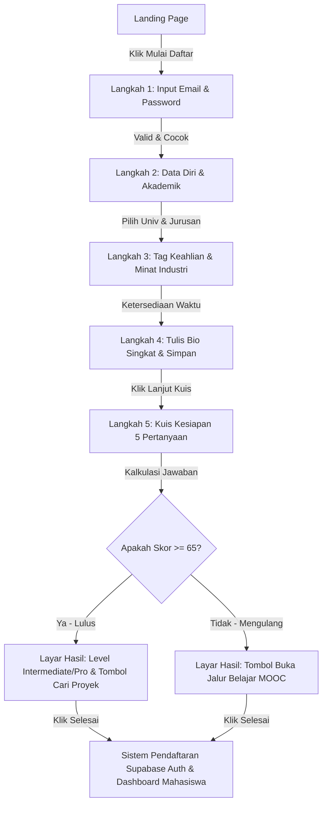
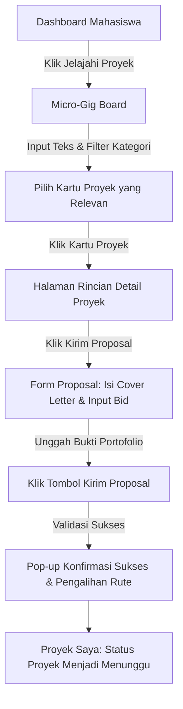
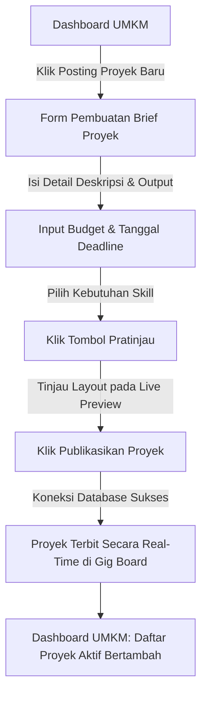
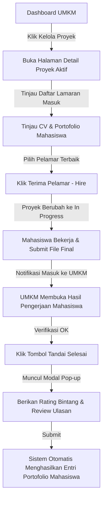
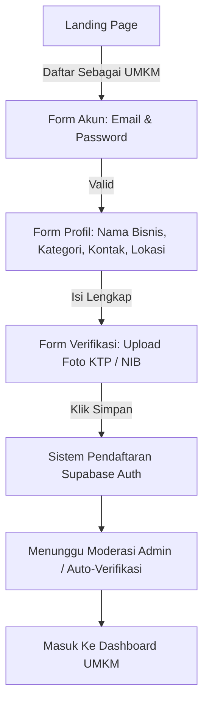
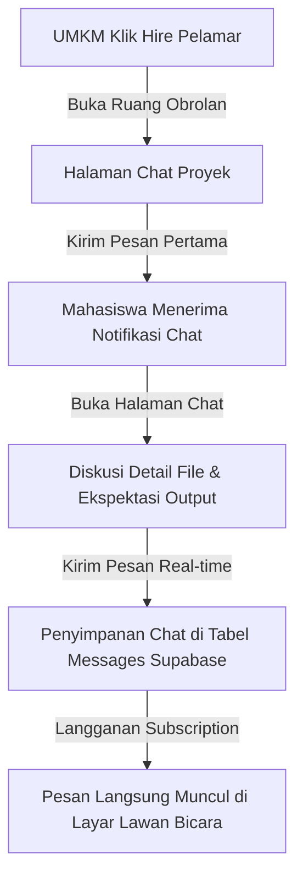
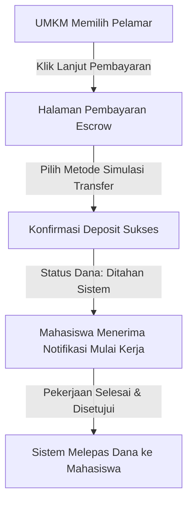
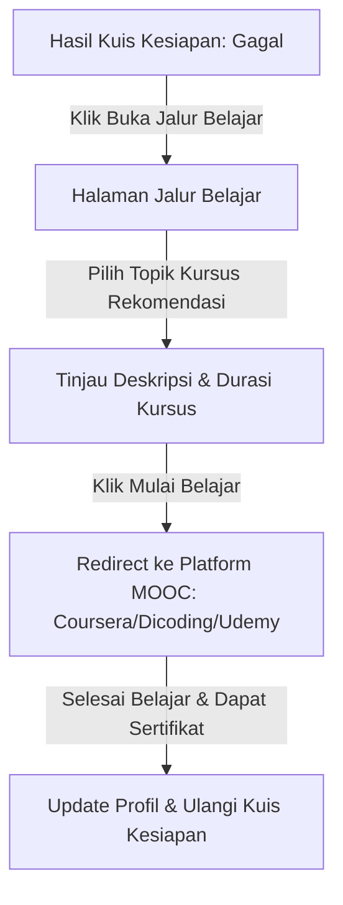

# LAPORAN PENGEMBANGAN
## Desain Front-End & Prototype UI/UX

---

| **Kelompok** | Nexus |
|---|---|
| **Sistem** | SkillGate (Ekosistem Digital Kampus-ke-Freelance Mahasiswa-UMKM) |
| **Mata Kuliah** | Pengembangan Sistem Informasi — Informatika UII |
| **Pertemuan** | 20 |

---

### 1 Ketertelusuran User Stories ke Prototype
Hubungkan user stories dari PRD kelompok dengan halaman dan komponen yang sudah dirancang dalam prototype.

| ID User Story (dari PRD) | Halaman Prototype | Komponen UI Utama |
|:---|:---|:---|
| **US-01** (Registrasi Akun Mahasiswa) | `/register/mahasiswa` (Langkah 1 & 2) | Form Input E-mail, Password, Pilihan Universitas, Jurusan, Semester, tag Minat. |
| **US-02** (Penentuan Jam Kerja) | `/register/mahasiswa` (Langkah 3) | Pilihan Pill Jam Kerja (3, 7, 15, 25 jam/minggu), Tombol Navigasi multi-step. |
| **US-03** (Kuis Kesiapan Freelance) | `/register/mahasiswa` (Langkah 4, 5, 6) | Question Card Pilihan Ganda, Progress Bar, Kalkulator Skor Dinamis. |
| **US-04** (Tampilan Skor & Hasil Asesmen) | `/register/mahasiswa` (Langkah 7) & `/dashboard/student` | Radial Progress Gauge Kesiapan, Badge Tingkat Kesiapan (Beginner/Intermediate/Pro), Rekomendasi MOOC. |
| **US-05** (Rekomendasi Jalur Belajar) | `/student/jalur-belajar` | Grid Card Kursus (Coursera, Udemy, Dicoding), Badge Durasi, Badge Tingkat Kesulitan, Link Akses Kursus. |
| **US-06** (Pencarian & Filter Proyek) | `/gigs` | Search Bar Teks, Filter Dropdown Multi-Kategori (IT/Desain, Kuliner, Fashion, Kriya), Card Proyek. |
| **US-07** (Detail Brief Proyek) | `/gigs/[id]` | Ringkasan UMKM (Rating Bintang), Badge Budget, Badge Deadline, Teks Deskripsi Brief Proyek, Syarat Keahlian. |
| **US-08** (Pengajuan Proposal Lamaran) | `/gigs/[id]/proposal` | Input Nominal Penawaran (Bid), Textarea Cover Letter, Portofolio File Drag-and-Drop Uploader. |
| **US-09** (Pemantauan Status Proyek) | `/student/proyek-saya` | Tab Filter Status (Menunggu, Aktif, Selesai), Badge Status Berwarna (Kuning, Biru, Hijau). |
| **US-10** (Penyerahan Deliverables) | `/student/proyek/[id]` | File Uploader Hasil Kerja, Teks Catatan Pengerjaan, Tombol Submit Final. |
| **US-11** (Portofolio Otomatis) | `/student/portfolio` | Riwayat Kerja Terverifikasi, Badge Kategori, Rating Ulasan UMKM, Generator Ringkasan CV, Tombol Cetak PDF. |
| **US-12** (Pendaftaran Akun UMKM) | `/register/umkm` | Form Email, Sandi, Nama Bisnis, Deskripsi Usaha, Input Dokumen Pendukung (KTP/NIB). |
| **US-13** (Posting Proyek Baru UMKM) | `/umkm/buat-proyek` | Form Detail Brief (Judul, Kategori, Deskripsi, Budget, Deadline), Tag Skill, Tombol Preview & Publish. |
| **US-14** (Pratinjau Brief Proyek) | `/umkm/buat-proyek` (Mode Preview) | Visualisasi Card Proyek Instan (Simulasi Tampilan di Gig Board sebelum posting). |
| **US-15** (Manajemen Pelamar Masuk) | `/umkm/proyek/[id]` | List Proposal Pelamar, Modal Review Detail Cover Letter, Lampiran Portofolio, Tombol Terima (Hire) / Tolak. |
| **US-16** (Penyelesaian Proyek & Review) | `/umkm/proyek/[id]` (Workspace) | Tinjau Deliverables Mahasiswa, Tombol Tandai Selesai, Modal Pop-up Input Bintang (1-5) dan Review Teks. |
| **US-17** (Real-time Chat) | `/chat` & `/umkm/chat` | Sidebar Kontak Proyek, Bubble Chat Kiri-Kanan, Indikator Status Online, Area Input Kirim Pesan Instan. |
| **US-18** (Pusat Bantuan / FAQ) | `/help` | Search Bar Topik FAQ, Akordeon Pertanyaan Umum (FAQ), Form Tiket Bantuan Admin. |

---

### 2 Inventaris Halaman / Screen Prototype
Daftarkan semua halaman yang telah dirancang. Kolom 'Jenis' diisi Lo-fi atau Hi-fi. Tandai status penyelesaian.

| No | Nama Halaman / Screen | Jenis | Fitur Utama | Status |
|:---:|:---|:---|:---|:---|
| 1 | `/` (Landing Page) | Hi-fi | Presentasi nilai platform, visualisasi alur, info statistik, dan tombol gerbang masuk utama. | ☑ Selesai ☐ Draft |
| 2 | `/auth` (Peran Gateway) | Hi-fi | Halaman pilihan peran pendaftaran (sebagai Mahasiswa atau UMKM). | ☑ Selesai ☐ Draft |
| 3 | `/login` (Form Masuk) | Hi-fi | Autentikasi akun via Supabase Auth dengan penanganan error dan pengarah rute otomatis berbasis role. | ☑ Selesai ☐ Draft |
| 4 | `/register/mahasiswa` | Hi-fi | Form registrasi mahasiswa multi-step (Akun, Data Diri, Keahlian, Bio) & Kuis Kesiapan dinamis. | ☑ Selesai ☐ Draft |
| 5 | `/register/umkm` | Hi-fi | Form registrasi bisnis UMKM multi-step (Akun, Profil Usaha, Verifikasi Dokumen KTP/NIB). | ☑ Selesai ☐ Draft |
| 6 | `/dashboard/student` | Hi-fi | Dashboard mahasiswa berisi skor kesiapan, sisa jam kerja, daftar proyek aktif, dan rekomendasi gig. | ☑ Selesai ☐ Draft |
| 7 | `/dashboard/umkm` | Hi-fi | Dashboard UMKM berisi ringkasan proyek terposting, jumlah pelamar menunggu, dan total pengeluaran. | ☑ Selesai ☐ Draft |
| 8 | `/gigs` (Micro-Gig Board) | Hi-fi | Papan pencarian lowongan proyek dengan fitur filter instan berdasarkan kategori dan bilah pencarian kata kunci. | ☑ Selesai ☐ Draft |
| 9 | `/gigs/[id]` (Detail Proyek) | Hi-fi | Halaman detail rincian proyek, spesifikasi output, anggaran, deadline, dan ulasan profil pemilik UMKM. | ☑ Selesai ☐ Draft |
| 10 | `/gigs/[id]/proposal` | Hi-fi | Halaman form pengajuan lamaran mahasiswa (unggah portofolio, input bid harga, cover letter). | ☑ Selesai ☐ Draft |
| 11 | `/student/proyek-saya` | Hi-fi | Pengelompokan status proyek mahasiswa (Menunggu persetujuan, Dalam Proses, Selesai). | ☑ Selesai ☐ Draft |
| 12 | `/student/proyek/[id]` | Hi-fi | Ruang kerja mahasiswa untuk menyerahkan hasil pengerjaan digital (deliverables) ke klien UMKM. | ☑ Selesai ☐ Draft |
| 13 | `/student/portfolio` | Hi-fi | Generator portofolio digital otomatis, CV resume terangkum, dan fungsi unduh dokumen PDF portofolio. | ☑ Selesai ☐ Draft |
| 14 | `/student/jalur-belajar` | Hi-fi | Daftar rekomendasi kursus MOOC terkurasi gratis bagi mahasiswa untuk meningkatkan kesiapan kerja. | ☑ Selesai ☐ Draft |
| 15 | `/student/settings` | Hi-fi | Panel pengaturan data diri, keahlian, ketersediaan jam kerja, dan notifikasi akun mahasiswa. | ☑ Selesai ☐ Draft |
| 16 | `/profile/[id]` | Hi-fi | Halaman profil publik mahasiswa yang dapat diakses UMKM untuk meninjau kecocokan portofolio & rating. | ☑ Selesai ☐ Draft |
| 17 | `/umkm-profile/[id]` | Hi-fi | Halaman profil publik UMKM yang menampilkan info toko/usaha, ulasan mahasiswa, dan proyek aktif. | ☑ Selesai ☐ Draft |
| 18 | `/umkm/buat-proyek` | Hi-fi | Form pembuatan brief proyek baru yang dilengkapi modul Live Preview sebelum proses publikasi. | ☑ Selesai ☐ Draft |
| 19 | `/umkm/proyek` | Hi-fi | Halaman pusat pengelolaan seluruh daftar proyek (aktif maupun historis) milik UMKM. | ☑ Selesai ☐ Draft |
| 20 | `/umkm/proyek/[id]` | Hi-fi | Halaman kelola pelamar masuk (review proposal) dan ruang kerja konfirmasi hasil pengerjaan. | ☑ Selesai ☐ Draft |
| 21 | `/umkm/pembayaran` | Hi-fi | Halaman simulasi sistem pembayaran aman (escrow) untuk menjamin keamanan dana proyek. | ☑ Selesai ☐ Draft |
| 22 | `/umkm/settings` | Hi-fi | Panel edit profil usaha UMKM, pengaturan rekening bank, dan data pemilik usaha. | ☑ Selesai ☐ Draft |
| 23 | `/chat` (dan `/umkm/chat`) | Hi-fi | Fitur pesan instan (chat) real-time antar mahasiswa dan UMKM untuk bernegosiasi atau berdiskusi proyek. | ☑ Selesai ☐ Draft |
| 24 | `/help` (Pusat Bantuan) | Hi-fi | Halaman FAQ interaktif dengan bilah pencarian artikel bantuan dan form kontak aduan admin. | ☑ Selesai ☐ Draft |

---

### 3 Ringkasan Design System
Dokumentasikan keputusan visual yang disepakati tim sebagai standar konsistensi antarmuka.

| Elemen | Nilai / Spesifikasi | Catatan / Contoh Penggunaan |
|:---|:---|:---|
| **Warna Primer** | Hex: `#005bbf` | Digunakan untuk header, tombol utama mahasiswa, teks penekanan penting, dan menu aktif sidebar mahasiswa. |
| **Warna Sekunder** | Hex: `#006e2c` | Digunakan untuk aksen bisnis, tombol aksi utama pada dashboard UMKM, serta penunjuk status sukses. |
| **Warna Error / Peringatan** | Hex: `#ba1a1a` | Digunakan untuk pesan kesalahan pengisian form, banner error autentikasi, dan tombol aksi destruktif (batal proyek). |
| **Font Utama** | Nama: `Inter` (sans-serif) | Digunakan untuk heading besar (H1, H2, H3) dan teks judul komponen agar terlihat kokoh dan modern. |
| **Font Body** | Nama: `Inter` \| Ukuran: `14px` (0.875rem) | Digunakan untuk teks deskripsi paragraf, label form, teks detail proyek, dan konten utama. |
| **Border Radius** | Tombol: `8px` (0.5rem) \| Card: `12px` (0.75rem) | Sudut membulat modern yang diaplikasikan pada seluruh tombol input dan kartu informasi di dashboard bento. |
| **Spacing / Grid Base** | Base: `4px` \| Kolom: `12-kolom` | Jarak antar elemen menggunakan kelipatan 4px (Tailwind spacing). Halaman utama disusun menggunakan grid 12-kolom yang responsif. |
| **Library Ikon** | Nama: `Lucide-react` | Kumpulan ikon garis minimalis yang digunakan secara konsisten di menu sidebar, tombol navigasi, dan indikator status. |

---

### 4 Checklist Prinsip Desain yang Diterapkan
Centang (☑) prinsip yang sudah diterapkan. Isi kolom terakhir dengan deskripsi singkat implementasinya dalam prototype.

| ☐ | Prinsip | Deskripsi Implementasi dalam Prototype |
|:---:|:---|:---|
| ☑ | **Visual Hierarchy** | Menyusun elemen penting dengan ukuran font besar dan warna kontras (misal: nominal budget dengan badge hijau tebal) untuk mengarahkan pandangan utama pengguna sebelum membaca deskripsi detail. |
| ☑ | **Konsistensi Visual** | Seluruh rute (24 halaman) menggunakan UI kit Shadcn dengan tipografi, ukuran radius rounded, ketebalan border, dan palet warna yang seragam untuk menciptakan pengalaman navigasi yang utuh. |
| ☑ | **Responsif / Mobile-First** | Tampilan antarmuka menggunakan Tailwind utility classes (seperti `grid-cols-1 lg:grid-cols-2`) sehingga susunan dashboard bento secara otomatis bergeser menjadi satu kolom vertikal yang rapi saat dibuka melalui smartphone. |
| ☑ | **Feedback Visual** | Menyediakan efek hover interaktif (seperti translasi pergeseran ikon panah saat tombol di-hover), indikator loading dinamis ("Memproses...") ketika menekan submit form pendaftaran, dan banner alert berwarna merah cerah saat terjadi kegagalan sistem. |
| ☑ | **Affordance Jelas** | Elemen interaktif dibuat menonjol dengan bayangan tipis (*shadow-sm*), border tebal berwarna biru primer saat kursor fokus pada kolom input, dan perubahan bentuk kursor menjadi *pointer* pada area yang bisa diklik. |
| ☑ | **Error Prevention** | Tombol pendaftaran dikunci (*disabled*) jika password tidak cocok atau kurang dari 8 karakter. Sistem juga menampilkan dialog konfirmasi sebelum tindakan destruktif (seperti membatalkan proyek). |
| ☑ | **Minimalist Design** | Memanfaatkan ruang kosong (*generous padding* dan *whitespace*) secara optimal. Menghilangkan elemen dekoratif tidak penting agar pengguna dapat fokus penuh pada tugas utama (mencari lowongan atau membaca proposal). |
| ☑ | **Aksesibilitas Dasar** | Memenuhi standar rasio kontras teks (teks gelap di atas background putih), pemakaian elemen `<Label>` yang eksplisit untuk membantu aksesibilitas pembaca layar (*screen reader*), serta navigasi keyboard yang teratur. |

---

### 5 User Flow
Tempel screenshot atau gambar user flow untuk keseluruhan fitur sistem. Sertakan nama fitur dan deskripsi singkat alurnya.

#### User Flow 1
* **Fitur:** Registrasi Mahasiswa & Pengukuran Skor Kesiapan Kerja (Onboarding & Assessment)
* **Diagram Alur:**

* **Deskripsi singkat alur:** Mahasiswa mendaftar dengan membuat akun, melengkapi profil akademik, dan wajib mengikuti kuis kesiapan (5 pertanyaan). Sistem menghitung skor pengerjaan secara dinamis. Jika skor memenuhi standar (≥65), mahasiswa diizinkan langsung mengakses Gig Board. Jika tidak (<65), mahasiswa diarahkan untuk mengikuti modul jalur belajar (MOOC) gratis terlebih dahulu. Proses penyimpanan data pendaftaran ke database dilakukan di akhir layar hasil kuis.

#### User Flow 2
* **Fitur:** Pencarian Kerja & Pengajuan Proposal Lamaran Mahasiswa (Gig Board & Proposal Submission)
* **Diagram Alur:**

* **Deskripsi singkat alur:** Mahasiswa masuk ke Gig Board, memfilter proyek sesuai bidangnya, lalu membuka rincian deskripsi proyek. Mahasiswa kemudian mengisi pendekatan kerja (cover letter), mengunggah berkas portofolio pendukung, menentukan harga penawaran kerja (*bid*), lalu menekan kirim. Proposal terkirim secara real-time ke database dan masuk ke daftar tunggu tinjauan UMKM.

#### User Flow 3
* **Fitur:** Pembuatan Brief Lowongan Kerja Baru oleh Pemilik UMKM (Project Posting with Live Preview)
* **Diagram Alur:**

* **Deskripsi singkat alur:** Pemilik UMKM mengisi data kebutuhan proyek (judul, deskripsi brief, anggaran, tenggat, keahlian). Sebelum diterbitkan, UMKM dapat melihat visualisasi *Live Preview* terlebih dahulu untuk memastikan tidak ada kesalahan ketik. Setelah dirasa pas, UMKM menekan tombol publikasikan dan proyek langsung terdaftar di papan lowongan mahasiswa.

#### User Flow 4
* **Fitur:** Penyeleksian Mahasiswa, Review Hasil Kerja, dan Penilaian Akhir Proyek (Applicant Selection & Completion)
* **Diagram Alur:**

* **Deskripsi singkat alur:** UMKM meninjau proposal mahasiswa yang masuk untuk proyek mereka, lalu merekrut pelamar terbaik. Setelah status proyek beralih ke "Dalam Proses", mahasiswa menyelesaikan tugas dan mengunggah berkas final. UMKM meninjau hasil tersebut, menandai proyek sebagai selesai, dan memberikan rating/ulasan. Sistem kemudian secara otomatis membukukan proyek selesai tersebut menjadi portofolio resmi mahasiswa.

#### User Flow 5
* **Fitur:** Registrasi Profil Bisnis & Verifikasi UMKM (UMKM Onboarding & Verification)
* **Diagram Alur:**

* **Deskripsi singkat alur:** Pemilik usaha UMKM melakukan pendaftaran dengan membuat akun email dan sandi. Setelah itu, mereka mengisi profil rinci mengenai nama bisnis, kategori bidang usaha, alamat, dan nomor kontak aktif. Untuk keperluan verifikasi keabsahan bisnis, UMKM mengunggah dokumen KTP atau NIB. Setelah draf profil disimpan ke database Supabase, akun akan diverifikasi sebelum UMKM dapat melakukan posting lowongan proyek.

#### User Flow 6
* **Fitur:** Negosiasi & Komunikasi Real-time Chat (Project Communication & Negotiation)
* **Diagram Alur:**

* **Deskripsi singkat alur:** Ketika UMKM menyetujui lamaran mahasiswa (menekan tombol Hire), ruang obrolan chat proyek otomatis terbentuk. Klien UMKM dapat memulai pesan pertama. Mahasiswa menerima notifikasi in-app dan diarahkan ke halaman chat. Diskusi pengerjaan, detail revisi, dan pengiriman file link dilakukan secara langsung. Pesan disimpan di database Supabase dan diperbarui di antarmuka kedua belah pihak secara real-time via realtime subscription.

#### User Flow 7
* **Fitur:** Simulasi Pembayaran Aman (Escrow Payment System)
* **Diagram Alur:**

* **Deskripsi singkat alur:** Sebelum mahasiswa diperbolehkan memulai pekerjaan di platform, UMKM diwajibkan melakukan deposit nominal anggaran proyek (escrow). UMKM memilih metode transfer simulasi pada halaman pembayaran. Ketika transfer berhasil dikonfirmasi oleh sistem, status dana akan menjadi "Ditahan". Mahasiswa kemudian mendapatkan notifikasi bahwa dana aman dan pekerjaan boleh dimulai. Setelah proyek ditandai selesai dan disetujui, dana escrow dilepaskan ke dompet mahasiswa.

#### User Flow 8
* **Fitur:** Akses Jalur Belajar MOOC (Education Pathway & Certification)
* **Diagram Alur:**

* **Deskripsi singkat alur:** Mahasiswa yang tidak memenuhi batas minimum nilai kuis kesiapan (<65) diarahkan secara sistematis ke halaman Jalur Belajar. Pada halaman tersebut, sistem menyajikan daftar kursus MOOC (seperti Dicoding, Coursera, Udemy) yang sesuai dengan bidang kegagalannya. Setelah menyelesaikan kursus tersebut secara mandiri di platform mitra, mahasiswa dapat memperbarui profil keahliannya dan mengulang pengerjaan kuis kesiapan.

---

### 6 Screenshot Prototype (Halaman Pilihan)
Tempel screenshot dari minimal 3 halaman utama prototype. Beri judul dan deskripsi singkat di bawah setiap gambar.

#### Halaman 1 — Nama: Dashboard Mahasiswa (Bento Grid Layout)

* **Deskripsi:** Halaman utama bagi mahasiswa setelah login. Menggunakan desain Bento Grid premium yang membagi informasi menjadi kartu-kartu visual terpisah: tingkat kesiapan kerja (*Readiness Score*), sisa jam kerja yang tersedia, pelacakan proyek aktif, riwayat penghasilan, dan daftar rekomendasi lowongan kerja terbaru yang cocok dengan keahlian mahasiswa.

#### Halaman 2 — Nama: Micro-Gig Board (Papan Lowongan Kerja)

* **Deskripsi:** Papan lowongan proyek mikro (*gigs*) di mana mahasiswa dapat mencari pekerjaan sampingan dari UMKM. Halaman ini memiliki kolom pencarian instan dan filter kategori industri (kuliner, retail, fashion, kriya, dll.) untuk memetakan proyek yang paling relevan dengan cepat.

#### Halaman 3 — Nama: Formulir Pengiriman Proposal Lamaran

* **Deskripsi:** Tampilan formulir pengiriman proposal ketika mahasiswa melamar sebuah proyek. Komponen UI utama terdiri dari kolom input teks pendekatan kerja (*cover letter*), estimasi waktu pengerjaan dalam hari, nominal penawaran harga (*bid*), dan area uploader berkas lampiran pendukung portofolio.

#### Halaman 4 — Nama: Dashboard Pengelolaan Proyek UMKM

* **Deskripsi:** Panel utama bagi pemilik usaha UMKM untuk memantau aktivitas proyeknya. Dashboard ini menampilkan statistik performa bisnis secara ringkas (jumlah proyek yang sedang dibuka, jumlah proposal mahasiswa yang menunggu ulasan, dan total dana yang diinvestasikan), serta daftar proyek terpopuler dalam proses tinjauan.

---

### 7 Catatan Proses & Kendala Tim

| Aspek | Catatan Detail |
|:---|:---|
| **Keputusan desain yang paling signifikan dalam sesi ini** | 1. **Penerapan Layout Bento Grid Interaktif pada Dashboard:** Memilih konsep desain Bento Grid modern untuk `/dashboard/student` dan `/dashboard/umkm` agar informasi statistik padat dapat tersaji secara visual dan dinamis tanpa membuat mata pengguna lelah. Memisahkan visualisasi skor kesiapan menggunakan custom radial progress gauge. 2. **Alur Form Registrasi Multi-Step Terintegrasi Kuis Kesiapan:** Memutuskan memecah proses pendaftaran mahasiswa yang panjang menjadi 7 langkah visual (*multi-step registration form*) dengan progress bar real-time, guna mengurangi *cognitive load* pengguna saat onboarding. |
| **Kendala yang dihadapi** | 1. **Hydration Mismatch Akibat Injeksi Ekstensi Browser:** Mengatasi isu peringatan hidrasi di konsol Next.js (React Server Components) ketika browser pengguna memiliki ekstensi pihak ketiga (seperti dompet kripto/Bybit wallet) yang menyisipkan data-atribut tambahan ke tag `<html>` sebelum hidrasi React selesai. Masalah ini diselesaikan dengan menerapkan atribut `suppressHydrationWarning` secara global pada file `layout.tsx`. 2. **Sinkronisasi State pada Controlled Components & Validasi TypeScript:** Integrasi input dropdown dan multiselect keahlian (menggunakan UI kit Shadcn) ke dalam hook state sempat memicu error kompilasi *build Next.js* karena perbedaan tipe data nilai default `string | null` vs `string`. Kendala diselesaikan dengan validasi safety guard bertipe default string kosong dan penanganan tipe data yang eksplisit. |
| **Yang perlu diselesaikan sebelum Pertemuan 21** | 1. Menyempurnakan transisi mikro (*micro-animations*) dan state skeleton loading pada saat perpindahan halaman agar transisi antar layar terasa lebih premium. 2. Merapikan komponen responsif sidebar navigasi (Hamburger Menu) pada resolusi layar mobile di bawah 375px agar tata letak tombol navigasi tidak menutupi area konten utama. |

---
**© 2026 Kelompok Nexus — Universitas Islam Indonesia**
