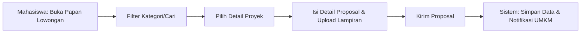
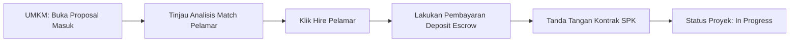
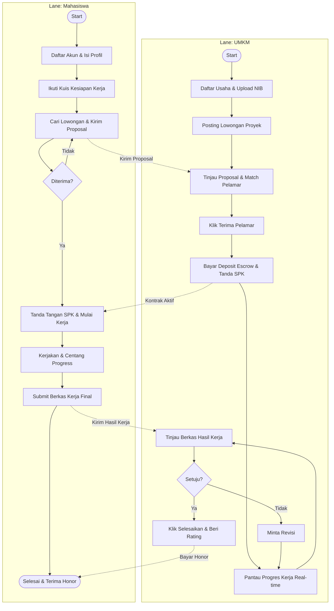
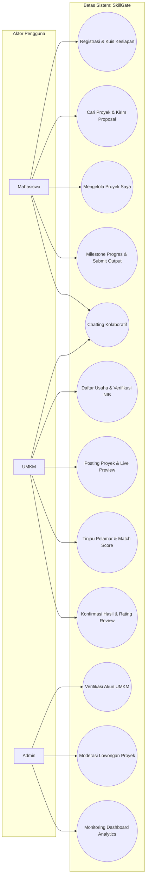
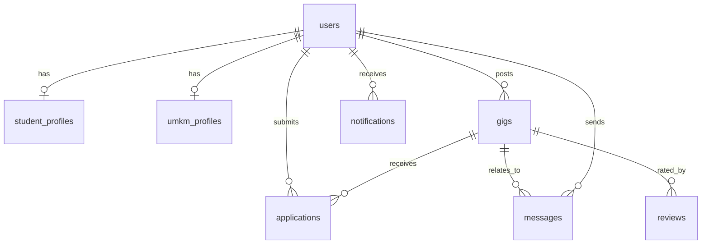
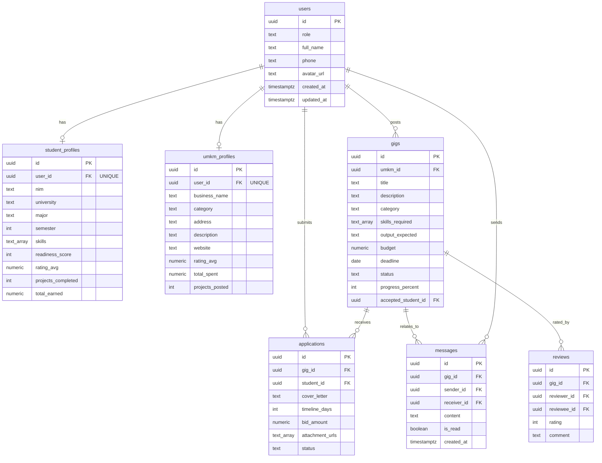
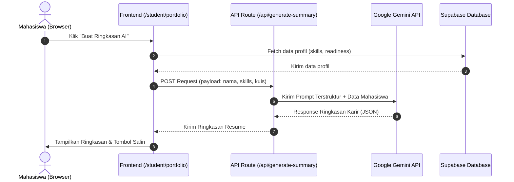
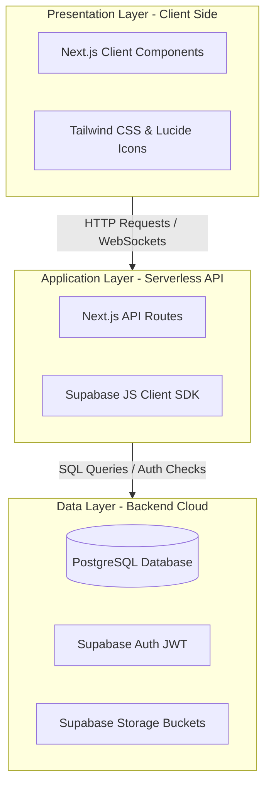

# TEMPLATE LAPORAN PROYEK TUGAS BESAR
# MATA KULIAH PENGEMBANGAN SISTEM INFORMASI

## HALAMAN JUDUL
### LAPORAN PROYEK TUGAS BESAR PENGEMBANGAN SISTEM INFORMASI
**SKILLGATE: Ekosistem Digital Kampus-ke-Freelance untuk Mahasiswa dan UMKM Lokal**

**Disusun oleh:**
*   Muhammad Rijalul Albab (NIM: 24523001) - Project Lead
*   Rifqi Aunnur Rohman (NIM: 24523063) - UI/UX Designer
*   Muhammad Farhan Yusuf Azizi (NIM: 24523003) - Research & Validation Lead
*   Jawara (NIM: 24523004) - Content & Community Strategist
*   Naila Reyhantyas Nurkhalisha (NIM: 24523050) - Digital Prototyper

**No. Kelompok:** 2  
**Nama Kelompok:** Nexus  
**Kelas:** E  
**Link Github:** https://github.com/mrijalulalbab/SkillGate.git  

**PROGRAM STUDI INFORMATIKA**  
**FAKULTAS TEKNOLOGI INDUSTRI**  
**UNIVERSITAS ISLAM INDONESIA**  
**TAHUN AKADEMIK: 2025/2026**

---

## DAFTAR ISI
1. [PENDAHULUAN](#1-pendahuluan)
   - 1.1 Latar Belakang
   - 1.2 Tujuan Proyek
   - 1.3 Ruang Lingkup
   - 1.4 Metodologi Pengembangan
2. [PROJECT CHARTER](#2-project-charter)
   - 2.1 Informasi Proyek
   - 2.2 Tujuan dan Sasaran Proyek
   - 2.3 Asumsi dan Risiko
   - 2.4 Persetujuan Stakeholder
3. [ANALISIS STAKEHOLDER DAN PENGGUNA](#3-analisis-stakeholder-dan-pengguna)
   - 3.1 Identifikasi Stakeholder
   - 3.2 Profil Pengguna
4. [ANALISIS KEBUTUHAN SISTEM](#4-analisis-kebutuhan-sistem)
   - 4.1 Kebutuhan Fungsional
   - 4.2 Kebutuhan Non-Fungsional
5. [DESAIN PROSES BISNIS](#5-desain-proses-bisnis)
   - 5.1 Proses Bisnis Utama
   - 5.2 Business Process Model Notation (BPMN)
6. [SPESIFIKASI FITUR DAN MAPPING PENGGUNA](#6-spesifikasi-fitur-dan-mapping-pengguna)
   - 6.1 Daftar Fitur Sistem
   - 6.2 Mapping Fitur terhadap Pengguna
   - 6.3 Use Case Diagram
   - 6.4 Skenario Use Case
7. [DESAIN DATABASE](#7-desain-database)
   - 7.1 Pemilihan Jenis Database
   - 7.2 Conceptual Data Model
   - 7.3 Logical Data Model
   - 7.4 Physical Data Model
8. [INTEGRASI LARGE LANGUAGE MODEL (LLM)](#8-integrasi-large-language-model-llm)
   - 8.1 Justifikasi Integrasi LLM
   - 8.2 Pemilihan LLM
   - 8.3 Fitur yang Menggunakan LLM
   - 8.4 Implementasi LLM
9. [DESAIN SISTEM DAN PROTOTIPE](#9-desain-sistem-dan-prototipe)
   - 9.1 Arsitektur Sistem
   - 9.2 Desain Interface
   - 9.3 API Design
10. [IMPLEMENTASI DAN TESTING](#10-implementasi-dan-testing)
    - 10.1 Implementasi
    - 10.2 Testing
11. [DOKUMENTASI FITUR DAN AKSES SISTEM](#11-dokumentasi-fitur-dan-akses-sistem)
    - 11.1 Daftar Fitur yang Dikembangkan
    - 11.2 Fitur LLM yang Diimplementasikan
    - 11.3 Akses Sistem
12. [KESIMPULAN DAN SARAN](#12-kesimpulan-dan-saran)
    - 12.1 Kesimpulan
    - 12.2 Keterbatasan
    - 12.3 Saran Pengembangan
13. [LAMPIRAN](#13-lampiran)

---

## 1. PENDAHULUAN

### 1.1 Latar Belakang
Daerah Istimewa Yogyakarta, khususnya Kabupaten Sleman, memiliki konsentrasi perguruan tinggi yang sangat tinggi dengan lebih dari 256.000 mahasiswa aktif. Mahasiswa ini dibekali dengan berbagai keterampilan akademis dan digital teoretis, namun sering kali kesulitan mencari peluang kerja paruh waktu atau proyek nyata untuk membangun portofolio profesional sebelum mereka lulus.

Di sisi lain, terdapat lebih dari 110.000 UMKM di Kabupaten Sleman yang sangat membutuhkan bantuan digital—seperti pembuatan poster promosi, pengelolaan konten media sosial, fotografi produk, hingga pencatatan data keuangan digital. Namun, UMKM sering kali tidak memiliki anggaran yang memadai untuk menyewa jasa agensi profesional, dan mereka kesulitan menemukan penyedia jasa lokal yang andal, murah, serta terpercaya.

**SkillGate** hadir sebagai solusi sistem informasi yang menjembatani kesenjangan struktural ini. Melalui model *micro-gig* terpercaya dan terintegrasi di lingkungan kampus, platform ini membantu mahasiswa mendapatkan proyek nyata berisiko rendah guna membangun reputasi, serta membantu UMKM memperoleh layanan digital berkualitas tinggi dengan anggaran yang terjangkau.

### 1.2 Tujuan Proyek
*   **Tujuan Umum**: Mengembangkan ekosistem digital berbasis web yang menghubungkan mahasiswa dengan pelaku UMKM lokal untuk pengerjaan proyek mikro digital secara terpercaya dan transparan.
*   **Tujuan Khusus**:
    1.  Membangun modul asesmen mandiri (kuis kesiapan kerja) bagi mahasiswa untuk mengukur kelayakan sebelum melamar kerja.
    2.  Menyediakan papan lowongan kerja (*micro-gig board*) yang relevan untuk kebutuhan UMKM.
    3.  Mengimplementasikan sistem pencocokan pelamar cerdas (*smart recommendation match*) menggunakan kriteria berbasis bobot keahlian, skor kesiapan, dan rating.
    4.  Membangun ruang kerja proyek yang dilengkapi dokumen kontrak SPK otomatis dan pelacakan milestone progres terintegrasi.
*   **Manfaat**:
    - **Bagi Mahasiswa**: Memperoleh portofolio kerja nyata yang terverifikasi, mengasah keterampilan praktis, dan mendapatkan pendapatan tambahan.
    - **Bagi UMKM**: Mempercepat transformasi digital dengan biaya yang terjangkau serta mendapatkan talenta lokal yang kompeten.

### 1.3 Ruang Lingkup
*   **Batasan Sistem**: Platform berbasis Next.js Web App yang dioptimalkan untuk perangkat mobile-responsive dengan integrasi database PostgreSQL via Supabase.
*   **Fitur Utama**:
    1.  Autentikasi multi-peran (Mahasiswa, UMKM, Admin).
    2.  Pendaftaran Mahasiswa dilengkapi asesmen/kuis kesiapan kerja & dashboard visual bento-grid.
    3.  Pendaftaran UMKM dilengkapi formulir verifikasi KTP/NIB.
    4.  Posting proyek UMKM dengan pratinjau langsung (*live preview*).
    5.  Sistem Pengaju proposal lamaran mahasiswa terintegrasi lampiran (PDF/DOC/DOCX/Gambar) dan pemilihan rekam jejak proyek relevan.
    6.  Fitur Rekomendasi Pelamar Terbaik (Decision Support System) berbasis bobot kriteria.
    7.  Ruang Kerja Kolaborasi dengan sistem checklist milestone progres, kontrak SPK otomatis, dan chat instan real-time.
    8.  Modul Jalur Belajar MOOC (Dicoding, Coursera, Udemy) untuk menjembatani kesenjangan keahlian.
*   **Di Luar Ruang Lingkup (Out of Scope)**:
    - Integrasi payment gateway gerbang bank riil (sistem menggunakan escrow simulasi).
    - Aplikasi seluler native (Android/iOS).

### 1.4 Metodologi Pengembangan
Sistem ini dikembangkan menggunakan metodologi **Agile Scrum** yang berfokus pada iterasi cepat, kolaborasi tim, dan pengiriman fungsionalitas produk dalam bentuk sprint 2 mingguan.
*   **Alur Kerja Tim**:
    1.  *Planning*: Menerjemahkan kebutuhan menjadi User Story.
    2.  *Design & Prototyping*: Pembuatan UI/UX menggunakan Figma.
    3.  *Sprint Development*: Koding front-end Next.js dan backend API Supabase Database.
    4.  *Testing & Verification*: Melakukan build check, unit testing komponen, serta user acceptance testing (UAT).
*   **Tools & Teknologi**: Next.js 16 (Turbopack), Tailwind CSS v4, TypeScript, Lucide React, dan Supabase (Auth, PostgreSQL DB, Realtime Channels).

---

## 2. PROJECT CHARTER

### 2.1 Informasi Proyek
| Komponen | Deskripsi |
|---|---|
| **Nama Proyek** | SkillGate (Ekosistem Digital Kampus-ke-Freelance Mahasiswa-UMKM) |
| **Sponsor Proyek** | Dosen Pengampu MK Pengembangan Sistem Informasi |
| **Project Manager** | Muhammad Rijalul Albab |
| **Tanggal Mulai** | 15 Mei 2026 |
| **Tanggal Selesai** | 6 Juli 2026 |

### 2.2 Tujuan dan Sasaran Proyek
*   **Tujuan Bisnis**: Menciptakan platform yang aman bagi transaksi jasa mikro digital dengan meminimalisir penipuan (baik mahasiswa tidak dibayar maupun UMKM menerima hasil kerja berkualitas buruk).
*   **Sasaran Terukur**:
    - Tingkat kelulusan kompilasi build produksi proyek adalah 100%.
    - Rata-rata waktu pencarian pelamar oleh UMKM di bawah 48 jam.
    - Persentase kecocokan keahlian terverifikasi di atas 70%.
*   **Deliverables**:
    - Source code aplikasi berbasis Next.js Web App yang dihosting di GitHub.
    - File skema database Supabase PostgreSQL (`.sql`).
    - Laporan akhir proyek.

### 2.3 Asumsi dan Risiko
*   **Asumsi**:
    - Mahasiswa memiliki laptop/smartphone dengan akses internet memadai.
    - Pemilik UMKM mengerti dasar pengoperasian browser web untuk memantau proposal.
*   **Risiko**:
    - *Keterbatasan Waktu*: Waktu pengembangan yang singkat membatasi implementasi fitur penanganan pembayaran riil.
    - *Mitigasi*: Mengembangkan halaman simulasi pembayaran escrow untuk membuktikan alur kerja logika dana aman sebelum diintegrasikan dengan gerbang pembayaran bank sungguhan di masa depan.

### 2.4 Persetujuan Stakeholder
*   **Tim Pengembang**: Muhammad Rijalul Albab (Project Lead) beserta seluruh anggota kelompok Nexus menyetujui rilis ini.
*   **Pembimbing**: Dosen Pengampu Mata Kuliah Pengembangan Sistem Informasi (UII).

---

## 3. ANALISIS STAKEHOLDER DAN PENGGUNA

### 3.1 Identifikasi Stakeholder
| No | Stakeholder | Peran | Kepentingan | Pengaruh |
|:---:|---|---|---|---|
| 1 | **Mahasiswa** | Pengguna Primer | Membutuhkan proyek digital mikro untuk portofolio & pendapatan tambahan. | Tinggi |
| 2 | **Pemilik UMKM** | Pengguna Primer | Membutuhkan jasa digital murah, andal, cepat untuk pengembangan bisnis. | Tinggi |
| 3 | **Admin Platform** | Pengguna Sekunder | Mengelola moderasi proyek, verifikasi dokumen UMKM, dan rekonsiliasi keuangan. | Sedang |
| 4 | **Perguruan Tinggi** | Pemangku Kepentingan | Memantau kesiapan kerja lulusan dan keaktifan magang/freelance mahasiswa. | Rendah |

### 3.2 Profil Pengguna

#### 3.2.1 Pengguna Primer (Mahasiswa)
*   **Deskripsi**: Mahasiswa aktif di wilayah Sleman/Yogyakarta yang memiliki keahlian digital dasar tetapi belum memiliki pengalaman kerja formal.
*   **Karakteristik**: Berusia 18-24 tahun, aktif menggunakan media sosial, menyukai fleksibilitas waktu kerja (part-time/freelance).
*   **Kebutuhan Utama**: Pembuktian portfolio yang valid, proses lamaran yang mudah, jaminan pembayaran tepat waktu.
*   **Tingkat Keahlian Teknis**: Menengah ke atas (akrab dengan tools seperti Canva, Figma, Office, coding editor, dll).

#### 3.2.2 Pengguna Primer (Pemilik UMKM)
*   **Deskripsi**: Pemilik usaha mikro, kecil, dan menengah lokal yang ingin melakukan go-digital pada aspek pemasaran atau operasional usaha mereka.
*   **Karakteristik**: Berusia 25-50 tahun, berfokus pada hasil praktis, memiliki keterbatasan anggaran (budget Rp50rb - Rp500rb per tugas).
*   **Kebutuhan Utama**: Kemudahan dalam mencari penyedia jasa terpercaya, transparansi proses pengerjaan, penyelesaian tugas sesuai ekspektasi.
*   **Tingkat Keahlian Teknis**: Pemula hingga menengah (terbiasa dengan WhatsApp dan aplikasi e-commerce dasar).

---

## 4. ANALISIS KEBUTUHAN SISTEM

### 4.1 Kebutuhan Fungsional

#### 4.1.1 Kebutuhan Mahasiswa
| ID | Kebutuhan | Deskripsi | Prioritas |
|:---:|---|---|:---:|
| **FR-01** | Registrasi Akun & Profil | Mengizinkan mahasiswa mendaftar akun dengan mengisi data universitas, jurusan, semester, skills, dan jam kerja mingguan. | High |
| **FR-02** | Asesmen Kuis Kesiapan | Menyajikan kuis kesiapan (5 pertanyaan studi kasus) dan menghitung nilai kesiapan kerja otomatis (skor 0-100%). | High |
| **FR-03** | Pencarian & Filter Proyek | Menelusuri daftar lowongan proyek aktif (*gigs*) dengan fitur pencarian kata kunci dan filter kategori industri. | High |
| **FR-04** | Pengiriman Proposal Lamaran | Mengajukan proposal lamaran kerja dengan cover letter, nominal bid, estimasi waktu, serta lampiran berkas (PDF/DOC/DOCX/Gambar) dan histori proyek. | High |
| **FR-05** | Akses Jalur Belajar MOOC | Menyajikan daftar rekomendasi kursus MOOC terkurasi (Coursera, Dicoding, Udemy) untuk meningkatkan kompetensi keahlian yang kurang. | Medium |
| **FR-06** | Portofolio Terintegrasi Otomatis | Menyusun entri portofolio mahasiswa secara otomatis setelah proyek disetujui selesai oleh klien UMKM. | High |

#### 4.1.2 Kebutuhan Pemilik UMKM
| ID | Kebutuhan | Deskripsi | Prioritas |
|:---:|---|---|:---:|
| **FR-07** | Registrasi & Verifikasi Dokumen | Mengizinkan UMKM mendaftarkan data usaha, melengkapi lokasi, dan mengunggah berkas legalitas (KTP/NIB) untuk verifikasi admin. | High |
| **FR-08** | Pembuatan Brief Proyek & Preview | Mengisi formulir pembuatan lowongan kerja baru yang dilengkapi dengan panel visualisasi pratinjau langsung (*live preview*). | Medium |
| **FR-09** | Manajemen & Seleksi Pelamar | Meninjau proposal masuk serta memanfaatkan fitur Smart Recommendation Match (SPK) untuk menilai kecocokan pelamar. | High |
| **FR-10** | Ruang Kerja Kolaboratif | Memantau pengerjaan proyek via checklist milestone, mengunduh kontrak SPK digital, dan bertukar pesan chat real-time. | High |

### 4.2 Kebutuhan Non-Fungsional
| ID | Kategori | Kebutuhan | Deskripsi |
|:---:|:---:|---|---|
| **NFR-01** | Performance | Kecepatan Pemuatan Halaman (*Page Load Speed*) | Halaman web harus memuat data dan merender komponen UI dalam waktu kurang dari 2 detik pada koneksi internet seluler standar (3G/4G). |
| **NFR-02** | Security | Keamanan Data & Kebijakan RLS | Hak akses data dikontrol menggunakan policy Row Level Security (RLS) PostgreSQL, dan kredensial database dilindungi dalam berkas `.env.local` yang tidak diunggah ke publik. |
| **NFR-03** | Usability | Responsivitas Tampilan (*Mobile-responsive*) | Antarmuka harus menyesuaikan tata letak (Bento Grid) secara otomatis agar optimal saat diakses menggunakan browser seluler (layar smartphone minimal 360px). |

---

## 5. DESAIN PROSES BISNIS

### 5.1 Proses Bisnis Utama

#### 5.1.1 Proses Pendaftaran Proyek & Pengiriman Proposal (Sisi Mahasiswa)
*   **Deskripsi**: Mahasiswa masuk mencari proyek aktif di Gig Board, meninjau detail kebutuhan, dan mengirimkan lamaran kerja.
*   **Aktor**: Mahasiswa, Sistem SkillGate.
*   **Trigger**: Mahasiswa menekan tombol "Jelajahi Proyek" di menu utama.
*   **Input**: Filter kategori proyek, cover letter lamaran, penawaran budget, berkas portofolio lampiran (PDF/DOCX/JPG).
*   **Output**: Data lamaran baru tersimpan di tabel `applications` dengan status `pending` dan notifikasi dikirim ke UMKM.


<details>
<summary><b>Salin Kode Mermaid Flowchart Mahasiswa</b></summary>

```text
graph LR
  A[Mahasiswa: Buka Papan Lowongan] --> B[Filter Kategori/Cari]
  B --> C[Pilih Detail Proyek]
  C --> D[Isi Detail Proposal & Upload Lampiran]
  D --> E[Kirim Proposal]
  E --> F[Sistem: Simpan Data & Notifikasi UMKM]
```
</details>

#### 5.1.2 Proses Rekrutmen & Pembayaran Escrow (Sisi UMKM)
*   **Deskripsi**: UMKM menerima notifikasi pelamar, meninjau persentase kecocokan kandidat, melakukan simulasi pembayaran escrow, dan menyetujui kontrak.
*   **Aktor**: UMKM, Sistem SkillGate.
*   **Trigger**: Berkas lamaran masuk dari mahasiswa.
*   **Input**: Penilaian skor kecocokan pelamar, konfirmasi nominal escrow, tanda tangan digital kontrak.
*   **Output**: Status proyek berubah menjadi `in_progress`, dana escrow ditahan oleh sistem, ruang obrolan obrolan proyek aktif.


<details>
<summary><b>Salin Kode Mermaid Flowchart UMKM</b></summary>

```text
graph LR
  A[UMKM: Buka Proposal Masuk] --> B[Tinjau Analisis Match Pelamar]
  B --> C[Klik Hire Pelamar]
  C --> D[Lakukan Pembayaran Deposit Escrow]
  D --> E[Tanda Tangan Kontrak SPK]
  E --> F[Status Proyek: In Progress]
```
</details>

### 5.2 Business Process Model Notation (BPMN)
Alur proses bisnis kolaboratif antar aktor digambarkan secara ringkas menggunakan diagram alur proses kerja (BPMN-like swimlanes) berikut:



<details>
<summary><b>Salin Kode Mermaid BPMN</b></summary>

```text
graph TD
  subgraph Mahasiswa [Lane: Mahasiswa]
    m1([Start]) --> m2[Daftar Akun & Isi Profil]
    m2 --> m3[Ikuti Kuis Kesiapan Kerja]
    m3 --> m4[Cari Lowongan & Kirim Proposal]
    m5{Diterima?}
    m5 -- Ya --> m6[Tanda Tangan SPK & Mulai Kerja]
    m5 -- Tidak --> m4
    m6 --> m7[Kerjakan & Centang Progress]
    m7 --> m8[Submit Berkas Kerja Final]
    m9([Selesai & Terima Honor])
  end

  subgraph UMKM [Lane: UMKM]
    u1([Start]) --> u2[Daftar Usaha & Upload NIB]
    u2 --> u3[Posting Lowongan Proyek]
    u3 --> u4[Tinjau Proposal & Match Pelamar]
    u4 --> u5[Klik Terima Pelamar]
    u5 --> u6[Bayar Deposit Escrow & Tanda SPK]
    u6 --> u7[Pantau Progres Kerja Real-time]
    u7 --> u8[Tinjau Berkas Hasil Kerja]
    u9{Setuju?}
    u9 -- Ya --> u10[Klik Selesaikan & Beri Rating]
    u9 -- Tidak --> u11[Minta Revisi]
    u11 --> u7
  end

  m4 -.->|Kirim Proposal| u4
  u6 -.->|Kontrak Aktif| m6
  m8 -.->|Kirim Hasil Kerja| u8
  u10 -.->|Bayar Honor| m9
```
</details>

> [!TIP]
> **Petunjuk Membuat Diagram BPMN Formal dengan Mudah dan Estetik:**
> 1. **Rekomendasi Tool**: Gunakan [bpmn.io (Demo Online)](https://demo.bpmn.io/) atau [Figma](https://figma.com/) (menggunakan plugin "BPMN Diagram Generator" atau template FigJam).
> 2. **Langkah Pembuatan**:
>    - Buat 2 Pool Horizontal: **Mahasiswa** dan **UMKM**.
>    - Tambahkan elemen *Start Event* (lingkaran tipis) di masing-masing pool.
>    - Gambar alur tugas menggunakan *Activity/Task* (persegi tumpul).
>    - Gunakan *Gateway* (belah ketupat) untuk keputusan penting seperti "Setujui?" dan "Diterima?".
>    - Hubungkan proses internal dengan *Sequence Flow* (garis panah lurus), dan koordinasi antar pool dengan *Message Flow* (garis putus-putus dengan lingkaran kosong).
>    - Ekspor diagram hasil akhir ke format **SVG** atau **PNG** berkualitas tinggi, kemudian masukkan ke laporan Anda.

---

## 6. SPESIFIKASI FITUR DAN MAPPING PENGGUNA

### 6.1 Daftar Fitur Sistem
*   **F-01: Asesmen Kesiapan Kerja**: Pertanyaan berbasis studi kasus praktis yang menghasilkan nilai kesiapan dalam rentang 0-100%. (Kompleksitas: Medium)
*   **F-02: Live Preview Posting Proyek**: Formulir pembuatan brief proyek yang menampilkan representasi visual dinamis di sisi kanan saat mengetik. (Kompleksitas: Low)
*   **F-03: SPK Kontrak Digital**: Surat Perjanjian Kerja digital dengan validasi tanda tangan otomatis berbasis tanggal dan uuid proyek yang siap dicetak/print. (Kompleksitas: Medium)
*   **F-04: Smart Candidate Recommendation**: Penghitungan otomatis kecocokan kandidat berdasarkan 3 bobot kriteria utama (Skills 40%, Kesiapan 35%, Rating 25%). (Kompleksitas: High)
*   **F-05: Real-time Collaboration Chat**: Ruang obrolan interaktif yang menghubungkan mahasiswa dan UMKM secara instan menggunakan Supabase Realtime Channels. (Kompleksitas: High)

### 6.2 Mapping Fitur terhadap Pengguna
| Fitur | Mahasiswa | Pemilik UMKM | Admin | Keterangan Akses |
|---|:---:|:---:|:---:|---|
| **F-01: Asesmen Kesiapan** | ✓ | ✗ | ✗ | Mahasiswa mengisi evaluasi kesiapan kerja saat pendaftaran. |
| **F-02: Live Preview Post** | ✗ | ✓ | ✗ | UMKM melihat pratinjau proyek sebelum memposting. |
| **F-03: SPK Kontrak Digital** | ✓ | ✓ | ✗ | Dibaca dan disetujui bersama oleh mahasiswa dan UMKM. |
| **F-04: Smart Recommendation**| ✗ | ✓ | ✗ | UMKM melihat skor persentase kelayakan pelamar. |
| **F-05: Real-time Chat** | ✓ | ✓ | ✗ | Sarana negosiasi dan kolaborasi proyek. |
| **Moderasi & Verifikasi** | ✗ | ✗ | ✓ | Admin meninjau data NIB UMKM dan status moderasi lowongan. |

### 6.3 Use Case Diagram
Struktur interaksi aktor dengan sistem didefinisikan secara visual menggunakan diagram Use Case berikut:



<details>
<summary><b>Salin Kode Mermaid Use Case Diagram</b></summary>

```text
graph LR
  subgraph Aktor [Aktor Pengguna]
    M[Mahasiswa]
    U[UMKM]
    A[Admin]
  end

  subgraph Batas_Sistem [Batas Sistem: SkillGate]
    uc1((Registrasi & Kuis Kesiapan))
    uc2((Cari Proyek & Kirim Proposal))
    uc3((Mengelola Proyek Saya))
    uc4((Milestone Progres & Submit Output))
    uc5((Chatting Kolaboratif))
    uc6((Daftar Usaha & Verifikasi NIB))
    uc7((Posting Proyek & Live Preview))
    uc8((Tinjau Pelamar & Match Score))
    uc9((Konfirmasi Hasil & Rating Review))
    uc10((Verifikasi Akun UMKM))
    uc11((Moderasi Lowongan Proyek))
    uc12((Monitoring Dashboard Analytics))
  end

  M --> uc1
  M --> uc2
  M --> uc3
  M --> uc4
  M --> uc5

  U --> uc6
  U --> uc7
  U --> uc8
  U --> uc9
  U --> uc5

  A --> uc10
  A --> uc11
  A --> uc12
```
</details>

> [!TIP]
> **Petunjuk Membuat Diagram Use Case Formal dengan Mudah:**
> 1. **Rekomendasi Tool**: Gunakan [Visual Paradigm Online](https://online.visual-paradigm.com/) atau [Draw.io](https://draw.io/).
> 2. **Langkah Pembuatan**:
>    - Letakkan simbol *Stick Man* untuk aktor **Mahasiswa**, **UMKM**, dan **Admin** di luar kotak batas sistem.
>    - Gambar kotak persegi panjang besar di tengah sebagai *System Boundary* dan beri label **"SkillGate"**.
>    - Masukkan simbol *Oval* (Use Case) di dalam kotak batas sistem untuk setiap aktivitas utama (misal: "Posting Proyek", "Kirim Proposal").
>    - Hubungkan aktor dengan use case yang sesuai menggunakan garis lurus tanpa panah (*Association Relationship*).
>    - Gunakan relasi `<<include>>` (garis putus-putus dengan panah mengarah ke use case pendukung) jika suatu use case membutuhkan use case lain (misal: "Kirim Proposal" `<<include>>` "Lulus Kuis Kesiapan").
>    - Simpan/Ekspor ke format PNG/SVG untuk disisipkan.

### 6.4 Skenario Use Case (Contoh: Menyeleksi Pelamar Terbaik - UC-04)
*   **ID**: UC-04
*   **Nama**: Menyeleksi Pelamar Terbaik (Smart Recommendation Analysis)
*   **Aktor**: Pemilik UMKM
*   **Deskripsi**: UMKM membuka daftar pelamar proyek dan menggunakan analisis kecocokan sistem untuk memilih mahasiswa.
*   **Precondition**: Proyek berstatus `open` dan minimal terdapat 1 lamaran masuk.
*   **Postcondition**: Pelamar terpilih disetujui, dialihkan ke halaman pembayaran escrow.
*   **Skenario Normal**:
    1. UMKM masuk ke halaman Detail Proyek Aktif.
    2. Sistem menyajikan daftar kartu proposal pelamar mahasiswa.
    3. UMKM mengklik tombol "Lihat Analisis Kecocokan" pada salah satu pelamar.
    4. Sistem menampilkan modal pop-up yang menjabarkan detail skor kecocokan keahlian (40%), kesiapan (35%), dan rating reputasi (25%).
    5. UMKM meninjau hasil analisis dan mengklik tombol "Terima Pelamar".
*   **Skenario Alternatif**:
    - Jika kecocokan keahlian sangat rendah (0%), sistem menandai tag keahlian berwarna merah untuk memperingatkan UMKM. UMKM dapat memilih untuk mengabaikan atau tetap menerima dengan toleransi tertentu.

---

## 7. DESAIN DATABASE

### 7.1 Pemilihan Jenis Database
*   **Tipe Database**: Relational Database (Transactional Database).
*   **Justifikasi**: Membutuhkan integritas referensial yang sangat kuat (ACID compliance) untuk menghubungkan relasi antar akun pengguna, status proyek, lamaran proposal, chat, dan transaksi pembayaran escrow agar tidak terjadi inkonsistensi data.
*   **DBMS**: PostgreSQL (dihosting secara cloud di platform Supabase).

### 7.2 Conceptual Data Model (ERD)
Hubungan logis konseptual antar entitas utama didefinisikan sebagai berikut:



<details>
<summary><b>Salin Kode Mermaid ERD (Conceptual)</b></summary>

```text
erDiagram
    users ||--o| student_profiles : "has"
    users ||--o| umkm_profiles : "has"
    users ||--o{ gigs : "posts"
    users ||--o{ applications : "submits"
    gigs ||--o{ applications : "receives"
    gigs ||--o{ messages : "relates_to"
    users ||--o{ messages : "sends"
    gigs ||--o{ reviews : "rated_by"
    users ||--o{ notifications : "receives"
```
</details>

> [!TIP]
> **Petunjuk Membuat Diagram ERD Relasional yang Rapi:**
> 1. **Rekomendasi Tool**: Gunakan [dbdiagram.io](https://dbdiagram.io/) (sangat mudah dengan kode teks DBML), [Draw.io](https://draw.io/), atau [Lucidchart](https://www.lucidchart.com/).
> 2. **Langkah Pembuatan**:
>    - Masukkan setiap tabel sebagai kotak entitas lengkap dengan tipe datanya (misal: `id: UUID (PK)`, `budget: NUMERIC`, `skills_required: TEXT[]`).
>    - Hubungkan tabel menggunakan garis relasi Crow's Foot:
>      - Garis lurus dengan dua garis silang (`||--||` atau `||--o|`) untuk relasi **One-to-One** (misal: `users` ke `student_profiles`).
>      - Garis bercabang tiga (`||--o{`) untuk relasi **One-to-Many** (misal: `users` ke `gigs`).
>    - Letakkan Kunci Utama (PK) di baris paling atas tabel, diikuti Kunci Asing (FK) di baris bawah.
>    - Ekspor file ke PNG/PDF untuk dimasukkan ke laporan sebagai representasi fisik database.

### 7.3 Logical Data Model

#### 7.3.1 Daftar Entitas Utama
1.  `users`: Menyimpan informasi akun login dasar (id, role, full_name, phone, avatar_url).
2.  `student_profiles`: Profil akademik mahasiswa (user_id, nim, university, major, skills, readiness_score, projects_completed, rating_avg).
3.  `umkm_profiles`: Profil bisnis UMKM (user_id, business_name, category, address, description, rating_avg, projects_posted).
4.  `gigs`: Data proyek yang diposting UMKM (id, umkm_id, title, description, budget, deadline, status, progress_percent, accepted_student_id).
5.  `applications`: Lamaran mahasiswa (id, gig_id, student_id, cover_letter, timeline_days, bid_amount, status).
6.  `messages`: Data riwayat chat (id, gig_id, sender_id, receiver_id, content, created_at).
7.  `reviews`: Data rating penyelesaian kerja (id, gig_id, reviewer_id, reviewee_id, rating, comment).

#### 7.3.2 Relationship Database Relasional
Sistem informasi SkillGate didukung oleh basis data relasional PostgreSQL dengan integritas referensial yang ketat untuk memastikan konsistensi seluruh alur transaksi micro-gig:
*   **One-to-One (1:1) Users ke Student/UMKM Profile**: 
    - Setiap akun dasar di tabel `users` memiliki tepat satu profil spesifik di `student_profiles` (jika mahasiswa) atau `umkm_profiles` (jika UMKM). Relasi ini diikat melalui foreign key `user_id` yang bersifat `UNIQUE` dan mereferensikan `users.id` dengan aturan `ON DELETE CASCADE`.
*   **One-to-Many (1:N) UMKM ke Gigs**:
    - Satu pelaku UMKM (`users.id`) dapat memposting banyak proyek mikro (`gigs.umkm_id`). Apabila akun UMKM dihapus, seluruh proyek terkait akan dihapus otomatis (`ON DELETE CASCADE`).
*   **One-to-Many (1:N) Gigs ke Applications**:
    - Setiap proyek mikro (`gigs.id`) dapat menerima banyak proposal lamaran dari mahasiswa (`applications.gig_id`). Sistem menerapkan constraint `UNIQUE(gig_id, student_id)` untuk memastikan satu mahasiswa hanya dapat mengirimkan satu lamaran per proyek.
*   **Many-to-One (N:1) Gigs ke Mahasiswa Terpilih**:
    - Kolom `gigs.accepted_student_id` menghubungkan proyek dengan mahasiswa pelaksana. Kolom ini mereferensikan `users.id` dengan aturan `ON DELETE SET NULL` guna mempertahankan data proyek meskipun akun pelaksana terhapus.
*   **One-to-Many (1:N) Gigs ke Messages (Chat)**:
    - Setiap pesan komunikasi real-time terikat pada proyek tertentu via `messages.gig_id` yang mereferensikan `gigs.id` untuk memisahkan ruang obrolan antar proyek secara aman.
*   **One-to-One / One-to-Many (1:N) Gigs ke Reviews**:
    - Ulasan hasil kerja terikat pada proyek via `reviews.gig_id`. Constraint `UNIQUE(gig_id, reviewer_id)` diterapkan agar ulasan hanya dapat diberikan sekali per pihak yang terlibat.

### 7.4 Physical Data Model

#### 7.4.1 Visualisasi Physical ERD (Skema Tabel & Kolom)
Berikut adalah visualisasi ERD Fisik (*Physical Data Model*) yang menunjukkan detail kolom, tipe data, serta *Primary Key* (PK) dan *Foreign Key* (FK) yang terintegrasi pada sistem SkillGate:



<details>
<summary><b>Salin Kode Mermaid Physical ERD</b></summary>

```text
erDiagram
    users {
        uuid id PK
        text role
        text full_name
        text phone
        text avatar_url
        timestamptz created_at
        timestamptz updated_at
    }
    student_profiles {
        uuid id PK
        uuid user_id FK "UNIQUE"
        text nim
        text university
        text major
        int semester
        text_array skills
        int readiness_score
        numeric rating_avg
        int projects_completed
        numeric total_earned
    }
    umkm_profiles {
        uuid id PK
        uuid user_id FK "UNIQUE"
        text business_name
        text category
        text address
        text description
        text website
        numeric rating_avg
        numeric total_spent
        int projects_posted
    }
    gigs {
        uuid id PK
        uuid umkm_id FK
        text title
        text description
        text category
        text_array skills_required
        text output_expected
        numeric budget
        date deadline
        text status
        int progress_percent
        uuid accepted_student_id FK
    }
    applications {
        uuid id PK
        uuid gig_id FK
        uuid student_id FK
        text cover_letter
        int timeline_days
        numeric bid_amount
        text_array attachment_urls
        text status
    }
    messages {
        uuid id PK
        uuid gig_id FK
        uuid sender_id FK
        uuid receiver_id FK
        text content
        boolean is_read
        timestamptz created_at
    }
    reviews {
        uuid id PK
        uuid gig_id FK
        uuid reviewer_id FK
        uuid reviewee_id FK
        int rating
        text comment
    }

    users ||--o| student_profiles : "has"
    users ||--o| umkm_profiles : "has"
    users ||--o{ gigs : "posts"
    users ||--o{ applications : "submits"
    gigs ||--o{ applications : "receives"
    gigs ||--o{ messages : "relates_to"
    users ||--o{ messages : "sends"
    gigs ||--o{ reviews : "rated_by"
```
</details>

#### 7.4.2 Struktur Tabel DDL SQL
Skema fisik diimplementasikan menggunakan perintah DDL SQL sebagai berikut:

```sql
-- Create Users Table
CREATE TABLE public.users (
  id uuid PRIMARY KEY REFERENCES auth.users(id) ON DELETE CASCADE,
  role text CHECK (role IN ('mahasiswa', 'umkm', 'admin')) NOT NULL DEFAULT 'mahasiswa',
  full_name text NOT NULL DEFAULT '',
  phone text DEFAULT '',
  avatar_url text DEFAULT '',
  created_at timestamptz DEFAULT now(),
  updated_at timestamptz DEFAULT now()
);

-- Create Student Profiles Table
CREATE TABLE public.student_profiles (
  id uuid PRIMARY KEY DEFAULT gen_random_uuid(),
  user_id uuid UNIQUE REFERENCES public.users(id) ON DELETE CASCADE,
  nim text DEFAULT '',
  university text DEFAULT '',
  major text DEFAULT '',
  semester int DEFAULT 1,
  skills text[] DEFAULT '{}',
  readiness_score int DEFAULT 0,
  rating_avg numeric(3,2) DEFAULT 0.00,
  projects_completed int DEFAULT 0,
  total_earned numeric(12,2) DEFAULT 0.00,
  created_at timestamptz DEFAULT now()
);

-- Create Gigs Table
CREATE TABLE public.gigs (
  id uuid PRIMARY KEY DEFAULT gen_random_uuid(),
  umkm_id uuid REFERENCES public.users(id) ON DELETE CASCADE,
  title text NOT NULL,
  description text DEFAULT '',
  category text DEFAULT '',
  skills_required text[] DEFAULT '{}',
  budget numeric(12,2) DEFAULT 0.00,
  deadline date,
  status text CHECK (status IN ('open', 'in_progress', 'completed', 'cancelled')) DEFAULT 'open',
  progress_percent int DEFAULT 0,
  accepted_student_id uuid REFERENCES public.users(id) ON DELETE SET NULL,
  created_at timestamptz DEFAULT now()
);
```

---

## 8. INTEGRASI LARGE LANGUAGE MODEL (LLM)

### 8.1 Justifikasi Integrasi LLM
*   **Alasan**: Mahasiswa sering kali kesulitan menyusun ringkasan karir profesional yang menarik bagi pemberi kerja dari data riwayat proyek mereka yang masih terbatas.
*   **Value**: Memberikan fitur generator resume cerdas instan berbasis data riwayat kerja platform untuk meningkatkan peluang perekrutan mahasiswa di luar SkillGate.
*   **Inovasi**: Integrasi asisten AI penyusun ringkasan CV (Curriculum Vitae) dinamis di halaman portofolio mahasiswa.

### 8.2 Pemilihan LLM
*   **Model**: Gemini 1.5 Pro / Claude 3.5 Sonnet.
*   **Justifikasi**: Unggul dalam penalaran instruksi terstruktur (JSON output) dan pemrosesan teks berbahasa Indonesia dengan gaya profesional.
*   **API/Service**: Vercel AI SDK dengan backend Google AI Studio API.

### 8.3 Fitur yang Menggunakan LLM
| Fitur | Fungsi LLM | Input | Output | Benefit |
|---|---|---|---|---|
| **AI Resume Summarizer** | Merangkum data profil, keahlian akademik, dan histori proyek kerja di platform menjadi deskripsi profil ringkas 3 kalimat. | Nama, Universitas, Jurusan, Keahlian, Daftar judul proyek selesai & rating. | Paragraf ringkasan eksekutif profil profesional yang siap disalin ke LinkedIn/CV. | Menghemat waktu mahasiswa dalam menulis deskripsi diri yang menjual. |

### 8.4 Implementasi LLM

#### 8.4.1 Arsitektur Integrasi
Alur koordinasi komunikasi sistem dengan kecerdasan buatan LLM Gemini digambarkan pada diagram sekuensial berikut:



<details>
<summary><b>Salin Kode Mermaid Arsitektur Integrasi LLM</b></summary>

```text
sequenceDiagram
  autonumber
  actor Student as Mahasiswa (Browser)
  participant FE as Frontend (/student/portfolio)
  participant BE as API Route (/api/generate-summary)
  participant GM as Google Gemini API
  participant DB as Supabase Database

  Student ->> FE: Klik "Buat Ringkasan AI"
  FE ->> DB: Fetch data profil (skills, readiness)
  DB -->> FE: Kirim data profil
  FE ->> BE: POST Request (payload: nama, skills, kuis)
  BE ->> GM: Kirim Prompt Terstruktur + Data Mahasiswa
  GM -->> BE: Response Ringkasan Karir (JSON)
  BE -->> FE: Kirim Ringkasan Resume
  FE ->> Student: Tampilkan Ringkasan & Tombol Salin
```
</details>

> [!TIP]
> **Petunjuk Membuat Diagram Sekuensial Integrasi AI yang Bagus:**
> 1. **Rekomendasi Tool**: Gunakan [WebSequenceDiagrams](https://www.websequencediagrams.com/) atau [Draw.io](https://draw.io/) (shape jenis "UML Sequence").
> 2. **Langkah Pembuatan**:
>    - Urutkan aktor dan subsistem dari kiri ke kanan secara kronologis: Aktor Mahasiswa -> Halaman Portfolio -> API Route `/api/generate-summary` -> Gemini SDK -> Supabase DB.
>    - Gunakan garis panah penuh (`->`) untuk panggilan sinkron dan garis panah putus-putus (`-->`) untuk data kembalian (*response return*).
>    - Tambahkan penomoran urutan proses secara berurutan guna mempermudah pemahaman alur data.

#### 8.4.2 Prompt Engineering
```markdown
Role: Profesional Recruiter & Resume Writer Bahasa Indonesia
Context: Anda membantu mahasiswa menulis ringkasan profil profesional (Summary) untuk CV berdasarkan data mereka.
Task: Tulis ringkasan profil 3 kalimat yang padat dan menarik. Kalimat pertama menjelaskan status akademik dan minat. Kalimat kedua menyoroti keahlian teknis dan skor kesiapan kerja. Kalimat ketiga menyimpulkan bukti kinerja nyata dari histori proyek di platform SkillGate.
Format: JSON {"summary": "teks ringkasan di sini"}
```

---

## 9. DESAIN SISTEM DAN PROTOTIPE

### 9.1 Arsitektur Sistem

#### 9.1.1 System Architecture Diagram
Aplikasi mengikuti arsitektur web modern **Serverless React 3-Tier**:



<details>
<summary><b>Salin Kode Mermaid Arsitektur Sistem 3-Tier</b></summary>

```text
graph TD
  subgraph Presentation_Layer [Presentation Layer - Client Side]
    FE1[Next.js Client Components]
    FE2[Tailwind CSS & Lucide Icons]
  end

  subgraph Application_Layer [Application Layer - Serverless API]
    BE1[Next.js API Routes]
    BE2[Supabase JS Client SDK]
  end

  subgraph Data_Layer [Data Layer - Backend Cloud]
    DB1[(PostgreSQL Database)]
    DB2[Supabase Auth JWT]
    DB3[Supabase Storage Buckets]
  end

  Presentation_Layer -->|HTTP Requests / WebSockets| Application_Layer
  Application_Layer -->|SQL Queries / Auth Checks| Data_Layer
```
</details>

> [!TIP]
> **Petunjuk Membuat Diagram Arsitektur 3-Tier yang Premium:**
> 1. **Rekomendasi Tool**: Gunakan [Figma](https://figma.com/) dengan kit ikon cloud (Vercel, Next.js, Postgres, Supabase) atau [Draw.io](https://draw.io/).
> 2. **Langkah Pembuatan**:
>    - Susun 3 kolom/kotak besar dari atas ke bawah: **Presentation Layer (Klien)**, **Application Layer (API)**, dan **Data Layer (Awan/DB)**.
>    - Gunakan warna latar belakang pastel yang berbeda lembut untuk masing-masing layer guna membedakan tanggung jawab wewenang (*separation of concerns*).
>    - Masukkan ikon atau logo resmi (PostgreSQL, Vercel, Next.js, Tailwind) di setiap representasi modul agar diagram terlihat modis dan berkelas profesional.
>    - Sambungkan antar layer dengan panah tebal bermata dua untuk merepresentasikan request-response dua arah.

#### 9.1.2 Technology Stack
*   **Frontend**: Next.js 16.2 (React 19, Turbopack compiler)
*   **Styling**: Tailwind CSS v4, Lucide React (Icons), Shadcn UI (Radix Primitives)
*   **Database & Auth**: Supabase PostgreSQL Service, Supabase Auth (JWT Verification)
*   **Hosting**: Vercel Cloud Platform (Front-end & API routes)

### 9.2 Desain Interface

#### 9.2.1 Wireframe & Mockup Halaman Utama
Mockup UI didesain bersih, modern, dan didominasi warna biru profesional `#005bbf` (mahasiswa) serta hijau bisnis `#006e2c` (UMKM). Layout menggunakan grid modular (Bento Box) yang responsif terhadap perubahan resolusi layar.

#### 9.2.2 Desain User Interface (Tampilan Implementasi Akhir)
Berikut adalah daftar tangkapan layar (*screenshot*) implementasi desain antarmuka aplikasi web SkillGate yang responsif dan mengikuti standar estetika modern:

1. **Dashboard Bento Mahasiswa (`/dashboard/student`)**:  
   Menyajikan visualisasi ringkas mengenai grafik pendapatan, total jam kerja mingguan, proyek aktif berjalan, serta histori status pengerjaan secara terpusat menggunakan model bento-grid.  
   

2. **Dashboard Bento UMKM (`/dashboard/umkm`)**:  
   Pusat kendali pemberi kerja (UMKM) untuk melacak status verifikasi akun, jumlah proyek aktif terpublikasi, total anggaran belanja escrow, serta memantau daftar lamaran proposal masuk secara real-time.  
   

3. **Papan Pencarian Lowongan Proyek (`/gigs`)**:  
   Halaman pencarian lowongan kerja mikro bagi mahasiswa pelamar digital, dilengkapi fitur filter klasifikasi kategori, penelusuran search bar, serta tampilan kartu proyek dengan indikator rating mitra UMKM.  
   

4. **Halaman Pengiriman Proposal (`/gigs/[id]/proposal`)**:  
   Formulir interaktif bagi mahasiswa pelamar untuk menyusun cover letter penawaran harga (*bid*), estimasi waktu durasi pengerjaan, highlight histori proyek terbaik, serta unggahan lampiran dokumen PDF.  
   

5. **Halaman Portofolio Akademik & AI Resume (`/student/portfolio`)**:  
   Tampilan portofolio kelulusan terverifikasi yang memuat statistik kerja riil, ulasan bintang dan testimoni asli dari klien UMKM, serta asisten AI Gemini penyusun draf CV karir profesional.  
   

### 9.3 API Design
Sistem berinteraksi langsung dengan database Supabase PostgreSQL menggunakan modul klien JavaScript (`@supabase/supabase-js`) yang memanfaatkan enkripsi JWT.

#### 9.3.1 API Endpoints (Untuk Operasi Custom)
| Method | Endpoint | Description | Request Payload | Response |
|---|---|---|---|---|
| **GET** | `/api/gigs` | Mengambil lowongan proyek aktif | - | `Array of Gigs` |
| **POST** | `/api/proposals`| Mengirimkan proposal baru | `{ gig_id, cover_letter, bid_amount }` | `Status: 201 Created` |
| **POST** | `/api/ai-summary` | Membuat ringkasan resume AI | `{ student_id }` | `{"summary": "text"}` |

#### 9.3.2 Dokumentasi API (API Documentation)
Sistem informasi SkillGate menggunakan dua jenis arsitektur API yang saling melengkapi untuk interaksi data:

1. **Auto-Generated REST API (PostgREST dari Supabase)**:
   - Supabase secara otomatis menghasilkan endpoint RESTful berbasis skema tabel PostgreSQL (`public.*`) yang didefinisikan pada database.
   - Keamanan: Setiap request wajib menyertakan header `apikey` (anon key) dan header `Authorization` berisi token JWT (`Bearer <TOKEN>`) milik pengguna yang sedang login untuk memicu validasi kebijakan keamanan tingkat baris (RLS).
   - **Contoh Request Pembacaan Lowongan Gigs**:
     ```http
     GET /rest/v1/gigs?status=eq.open HTTP/1.1
     Host: your-project-ref.supabase.co
     apikey: YOUR_ANON_KEY
     Authorization: Bearer YOUR_USER_JWT
     ```

2. **Custom API Routes (Next.js Route Handlers)**:
   - Digunakan untuk operasi asinkron yang membutuhkan proses komputasi serverless terisolasi (seperti integrasi dengan API pihak ketiga Google Gemini).
   - **Endpoint**: `POST /api/generate-summary` (Modul Generator Portofolio AI)
     - *Request Payload (JSON)*:
       ```json
       {
         "name": "Anto",
         "skills": ["Canva", "Adobe Photoshop"],
         "readinessScore": 82,
         "totalProjects": 3,
         "avgRating": 4.7
       }
       ```
     - *Response Output (JSON)*:
       ```json
       {
         "summary": "Anto adalah mahasiswa Teknik Informatika Universitas Islam Indonesia yang memiliki kompetensi kuat di bidang Canva dan Adobe Photoshop..."
       }
       ```

Dokumentasi API lengkap yang terintegrasi secara otomatis dengan skema fisik tabel database dapat diakses oleh tim pengembang melalui dashboard dokumentasi resmi proyek di: **`https://supabase.com/dashboard/project/_/api`**

---

## 10. IMPLEMENTASI DAN TESTING

### 10.1 Implementasi

#### 10.1.1 Development Environment
*   **OS**: Windows 11 Home (x64)
*   **IDE**: Visual Studio Code v1.90
*   **Version Control**: Git v2.43 (Repositori di-hosting di GitHub)
*   **Runtimes**: Node.js v20.12.0, npm v10.5.0

#### 10.1.2 Coding Standards
*   **Naming Convention**: Menggunakan *camelCase* untuk penamaan variabel dan fungsi JavaScript/TypeScript (contoh: `handleSubmitProposal`), serta *PascalCase* untuk nama komponen React (contoh: `ToastNotification`).
*   **Code Structure**: Folder disusun mengikuti struktur modular App Router Next.js (`src/app/`, `src/components/`, `src/lib/`, `supabase/migrations/`).
*   **Safety Guards**: Menambahkan penanganan error `try-catch` di setiap fungsi asinkron database dan validasi nullish coalescing (`??`) untuk menghindari error rendering di sisi klien.

### 10.2 Testing
Pengujian dilakukan terhadap populasi target pengguna (Mahasiswa Informatika UII Angkatan 2024 dan Pelaku UMKM Batik di daerah Sleman).

#### 10.2.1 Unit Testing
Pengujian komponen mandiri seperti fungsionalitas rendering dinamis `ToastNotification` dan kalkulator fungsi budget `formatBudget` untuk memastikan input nominal angka dikonversi dengan benar (contoh: `300000` menjadi `Rp300rb`).

#### 10.2.2 User Acceptance Testing (UAT)
Melakukan simulasi langsung pendaftaran akun baru, pengerjaan kuis kesiapan kerja, posting proyek, dan pengajuan proposal. Skenario UAT mencakup verifikasi perubahan data real-time pada database saat mahasiswa memperbarui checklist progres milestonenya.

#### 10.2.3 Pengujian Fungsional
Memastikan policy RLS (Row Level Security) Supabase bekerja secara tepat. Klien UMKM hanya dapat memperbarui proyek miliknya, dan mahasiswa yang diterima hanya dapat memperbarui progres proyek yang ia kerjakan.

## 11. DOKUMENTASI FITUR DAN AKSES SISTEM

### 11.1 Daftar Fitur yang Dikembangkan

#### 11.1.1 Modul Asesmen Mandiri & Kuis Kesiapan Kerja Mahasiswa
*   **Deskripsi**: Kuis interaktif berbasis 5 studi kasus etika kerja dan komunikasi profesional untuk mengukur kelayakan mahasiswa sebelum melamar proyek.
*   **Fungsionalitas**: Menyajikan pertanyaan pilihan ganda secara dinamis, mengevaluasi jawaban, mengkalkulasi skor kesiapan kerja (0-100%), serta meng-update kolom `readiness_score` pada `student_profiles` di database.
*   **Pengguna**: Mahasiswa
*   **Cara Penggunaan**:
    1. Login sebagai Mahasiswa.
    2. Buka halaman pengaturan akademik (`/student/settings`).
    3. Pilih tab Akademik dan klik tombol **"Mulai Kuis Kesiapan Kerja"**.
    4. Selesaikan semua 5 pertanyaan kuis dan kirim jawaban.
*   **Screenshot**:  
    

#### 11.1.2 Papan Lowongan Kerja (Gigs Board) & Sistem Proposal
*   **Deskripsi**: Ruang penelusuran lowongan proyek mikro digital yang diposting oleh UMKM Sleman untuk mahasiswa pelamar kerja.
*   **Fungsionalitas**: Pencarian teks, filter berdasarkan kategori pekerjaan (Desain Grafis, Administrasi, Fotografi, Media Sosial), kalkulasi kecocokan skor rekomendasi pelamar, pengiriman proposal (cover letter, bid dana, durasi kerja), dan file uploader lampiran portofolio.
*   **Pengguna**: Mahasiswa (pencari proyek) dan UMKM (pemberi proyek)
*   **Cara Penggunaan**:
    1. Akses halaman `/gigs`.
    2. Cari proyek atau gunakan filter kategori.
    3. Klik proyek untuk melihat detail persyaratan dan kecocokan skor.
    4. Klik tombol **"Kirim Proposal"**, isi data nominal bid beserta berkas lampiran, kemudian submit.
*   **Screenshot**:  
    

#### 11.1.3 Ruang Kerja Kolaborasi & Kontrak SPK Otomatis
*   **Deskripsi**: Halaman workspace interaktif tempat mahasiswa pelaksana dan UMKM pemberi kerja berkolaborasi menyelesaikan proyek pasca-persetujuan proposal lamaran.
*   **Fungsionalitas**: Menghasilkan dokumen digital Surat Perjanjian Kerja (SPK) secara otomatis dengan parameter dana escrow terjamin, chat obrolan terintegrasi secara real-time, checklist milestone progres kerja, serta sistem konfirmasi penyerahan hasil output kerja.
*   **Pengguna**: Mahasiswa dan UMKM yang sedang dalam masa kontrak kerja aktif
*   **Cara Penggunaan**:
    1. UMKM menyetujui proposal mahasiswa dan melakukan simulasi deposit dana escrow.
    2. Mahasiswa membuka halaman detail proyek di `/student/proyek/[id]`.
    3. Klik **"Lihat Dokumen Kontrak SPK"** untuk membaca hak dan kewajiban.
    4. Berkoordinasi lewat chat di tab obrolan, memperbarui checklist milestone pengerjaan, dan menyerahkan hasil kerja akhir.
*   **Screenshot**:  
    

### 11.2 Fitur LLM yang Diimplementasikan

#### 11.2.1 AI Resume Summary Generator
*   **Deskripsi**: Fitur asisten cerdas berbasis AI generatif yang merangkum kompetensi akademik mahasiswa dan histori reputasi proyek yang diselesaikannya di platform SkillGate ke dalam paragraf profil profesional siap pakai.
*   **Input**: Nama mahasiswa, program studi, universitas, daftar keahlian (*skills*), skor kesiapan kerja (*readiness score*), jumlah total proyek selesai, dan rata-rata rating ulasan klien UMKM.
*   **Processing**: Frontend mengumpulkan parameter metadata di atas, mengirimkannya via API endpoint backend `/api/generate-summary` ke API Google Gemini. LLM memproses data melalui instruksi *System Prompt* terstruktur agar menghasilkan ringkasan profesional eksekutif bahasa Indonesia sepanjang 3 kalimat padat.
*   **Output**: Paragraf ringkasan eksekutif profil profesional yang siap disalin oleh mahasiswa ke profil LinkedIn, CV fisik, atau berkas portofolio eksternal mereka.
*   **Demo**:  
    

### 11.3 Akses Sistem

#### 11.3.1 URL dan Repository
*   **URL Lokal Development**: `http://localhost:3000` (dijalankan menggunakan `npm run dev`)
*   **Repository Code**: https://github.com/mrijalulalbab/SkillGate.git
*   **API Database**: Supabase Client SDK

#### 11.3.2 Kredensial Testing

| Role | Username | Password | Akses |
|---|---|---|---|
| **Admin** | `admin@skillgate.com` | `password123` | Akses penuh dashboard administrasi, statistik keuangan, verifikasi UMKM, dan moderasi gigs. |
| **Mahasiswa (Andi)** | `andi@student.uii.ac.id` | `password123` | Akses penuh pencarian gig, pengiriman proposal, pengisian kuis, pengerjaan proyek aktif, dan ekspor portofolio AI. |
| **Mahasiswa (Anto)** | `anto@student.uii.ac.id` | `password123` | Akun mahasiswa pengujian bersih dengan histori data portofolio terverifikasi. |
| **UMKM (Darmi)** | `darmi@batiksleman.com` | `password123` | Akses posting proyek, pratinjau langsung, peninjauan pelamar terbaik, deposit dana aman, chat, dan review mahasiswa. |

#### 11.3.3 Panduan Akses
1.  **Untuk Admin**:
    *   Buka browser dan buka menu login di `/login`.
    *   Masukkan username `admin@skillgate.com` dan password `password123`.
    *   Sistem akan mengarahkan ke `/dashboard/admin` di mana Admin dapat mengelola moderasi status verifikasi pendaftaran akun UMKM baru serta memantau kesehatan seluruh ekosistem transaksi.
2.  **Untuk User**:
    *   Registrasi akun baru melalui halaman `/register/mahasiswa` atau `/register/umkm`, atau login menggunakan kredensial testing di atas di halaman `/login`.
    *   Setelah login berhasil, sistem akan mengarahkan ke dashboard bento personal masing-masing role (`/dashboard/student` atau `/dashboard/umkm`).
    *   Buka menu relevan pada navbar (Pencarian Gigs `/gigs`, Manajemen Proyek, Portofolio AI, maupun halaman chat untuk menguji fungsionalitas sistem informasi).

---

## 12. KESIMPULAN DAN SARAN

### 12.1 Kesimpulan
*   **Pencapaian Tujuan**: Proyek pengembangan sistem informasi SkillGate berhasil mencapai tujuannya dengan menyediakan ekosistem terpercaya yang menjembatani kolaborasi digital produktif antara mahasiswa dan UMKM Sleman secara aman dan terverifikasi.
*   **Fitur yang Berhasil Diimplementasikan**: Modul registrasi multi-peran, sistem kuis asesmen mandiri, kalkulator bobot kecocokan pelamar cerdas, pratinjau langsung postingan proyek UMKM, ruang kerja kolaborasi, notifikasi toast, dokumen kontrak kerja SPK dinamis otomatis, dan riwayat chat real-time.
*   **Integrasi LLM**: AI Resume Executive Summary berhasil diintegrasikan menggunakan API Google Gemini untuk menghasilkan ringkasan profil profesional berbasis performa riil mahasiswa di platform.
*   **Manfaat yang Dihasilkan**: Mahasiswa mendapatkan kesempatan kerja riil secara fleksibel untuk membangun reputasi portfolio berbayar, sementara UMKM lokal dapat mempercepat transformasi digital operasional mereka dengan anggaran yang terjangkau tanpa risiko penipuan.

### 12.2 Keterbatasan
*   **Keterbatasan Teknis**: Verifikasi berkas legalitas UMKM (NIB/KTP) belum terintegrasi secara otomatis dengan database API instansi pemerintah daerah Sleman, sehingga masih memerlukan verifikasi semi-manual di sisi dashboard admin.
*   **Keterbatasan Fitur**: Sistem transfer pembayaran honorarium masih berupa simulasi rekening escrow internal dan belum terintegrasi secara komersial dengan gerbang pembayaran (payment gateway) perbankan riil.
*   **Keterbatasan Waktu**: Alokasi waktu pengerjaan proyek tugas besar yang terbatas membatasi pengujian performa beban tinggi (stress testing) pada fitur obrolan chat sinkron saat diakses ribuan pengguna bersamaan.

### 12.3 Saran Pengembangan
*   **Fitur Tambahan**: Penambahan fitur bot asisten AI pembuat deskripsi brief kebutuhan proyek secara terpandu untuk membantu pelaku UMKM pemula.
*   **Peningkatan Performa**: Implementasi database caching menggunakan Redis untuk mengoptimalkan pemuatan daftar lowongan kerja (*gigs*) ber-traffic tinggi.
*   **Perbaikan UX/UI**: Peningkatan desain navigasi interaktif pada visualisasi jalur belajar MOOC mahasiswa agar lebih ramah pengguna.
*   **Integrasi Lanjutan**: Integrasi layanan payment gateway resmi (seperti Midtrans or Xendit) untuk memfasilitasi transaksi escrow antar-rekening bank lokal secara riil.

---

## 13. LAMPIRAN

*   **Lampiran A: Kode Program Utama**: Berkas repositori penuh dapat diakses di https://github.com/mrijalulalbab/SkillGate.git
*   **Lampiran B: Skema Database (SQL)**: File migrasi inisialisasi tabel, relasi, dan fungsi RLS tersimpan dalam berkas [init_schema.sql](file:///c:/Data%20Pribadi/Kuliah/Semester%204/Pengembangan%20Sistem%20Informasi/SkillGate/supabase/migrations/20260619234322_init_schema.sql).
*   **Lampiran C: User Manual**: Panduan penggunaan lengkap untuk mahasiswa dan UMKM tersimpan secara interaktif di halaman Bantuan FAQ (`/help`).
*   **Lampiran D: Gambar Antarmuka**: Screenshot mockup visual utama untuk Dashboard Mahasiswa, Gig Board, Formulir Proposal, dan Dashboard UMKM dapat ditinjau langsung di berkas internal platform.

---
**© 2026 Kelompok Nexus — Universitas Islam Indonesia**
