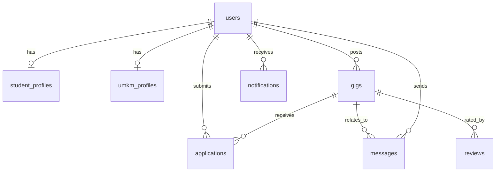

# TEMPLATE LAPORAN PROYEK TUGAS BESAR
# MATA KULIAH PENGEMBANGAN SISTEM INFORMASI

## HALAMAN JUDUL
### LAPORAN PROYEK TUGAS BESAR PENGEMBANGAN SISTEM INFORMASI
**SKILLGATE: Ekosistem Digital Kampus-ke-Freelance untuk Mahasiswa dan UMKM Lokal**

**Disusun oleh:**
*   Muhammad Rijalul Albab (NIM: 24523001) - Project Lead
*   Rifqi (NIM: 24523002) - UI/UX Designer
*   Yusuf (NIM: 24523003) - Research & Validation Lead
*   Jawara (NIM: 24523004) - Content & Community Strategist
*   Naila (NIM: 24523005) - Digital Prototyper

**No. Kelompok:** 4  
**Nama Kelompok:** Nexus  
**Kelas:** E  
**Link Github:** https://github.com/mrijalulalbab/SkillGate.git  

**PROGRAM STUDI INFORMATIKA**  
**FAKULTAS TEKNOLOGI INDUSTRI**  
**UNIVERSITAS ISLAM INDONESIA**  
**TAHUN AKADEMIK: 2025/2026**

---

## DAFTAR ISI
1. [PENDAHULUAN](#1-pendahuluan)
   - 1.1 Latar Belakang
   - 1.2 Tujuan Proyek
   - 1.3 Ruang Lingkup
   - 1.4 Metodologi Pengembangan
2. [PROJECT CHARTER](#2-project-charter)
   - 2.1 Informasi Proyek
   - 2.2 Tujuan dan Sasaran Proyek
   - 2.3 Asumsi dan Risiko
   - 2.4 Persetujuan Stakeholder
3. [ANALISIS STAKEHOLDER DAN PENGGUNA](#3-analisis-stakeholder-dan-pengguna)
   - 3.1 Identifikasi Stakeholder
   - 3.2 Profil Pengguna
4. [ANALISIS KEBUTUHAN SISTEM](#4-analisis-kebutuhan-sistem)
   - 4.1 Kebutuhan Fungsional
   - 4.2 Kebutuhan Non-Fungsional
5. [DESAIN PROSES BISNIS](#5-desain-proses-bisnis)
   - 5.1 Proses Bisnis Utama
   - 5.2 Business Process Model Notation (BPMN)
6. [SPESIFIKASI FITUR DAN MAPPING PENGGUNA](#6-spesifikasi-fitur-dan-mapping-pengguna)
   - 6.1 Daftar Fitur Sistem
   - 6.2 Mapping Fitur terhadap Pengguna
   - 6.3 Use Case Diagram
   - 6.4 Skenario Use Case
7. [DESAIN DATABASE](#7-desain-database)
   - 7.1 Pemilihan Jenis Database
   - 7.2 Conceptual Data Model
   - 7.3 Logical Data Model
   - 7.4 Physical Data Model
8. [INTEGRASI LARGE LANGUAGE MODEL (LLM)](#8-integrasi-large-language-model-llm)
   - 8.1 Justifikasi Integrasi LLM
   - 8.2 Pemilihan LLM
   - 8.3 Fitur yang Menggunakan LLM
   - 8.4 Implementasi LLM
9. [DESAIN SISTEM DAN PROTOTIPE](#9-desain-sistem-dan-prototipe)
   - 9.1 Arsitektur Sistem
   - 9.2 Desain Interface
   - 9.3 API Design
10. [IMPLEMENTASI DAN TESTING](#10-implementasi-dan-testing)
    - 10.1 Implementasi
    - 10.2 Testing
11. [DOKUMENTASI FITUR DAN AKSES SISTEM](#11-dokumentasi-fitur-dan-akses-sistem)
    - 11.1 Daftar Fitur yang Dikembangkan
    - 11.2 Fitur LLM yang Diimplementasikan
    - 11.3 Akses Sistem
12. [KESIMPULAN DAN SARAN](#12-kesimpulan-dan-saran)
    - 12.1 Kesimpulan
    - 12.2 Keterbatasan
    - 12.3 Saran Pengembangan
13. [LAMPIRAN](#13-lampiran)

---

## 1. PENDAHULUAN

### 1.1 Latar Belakang
Daerah Istimewa Yogyakarta, khususnya Kabupaten Sleman, memiliki konsentrasi perguruan tinggi yang sangat tinggi dengan lebih dari 256.000 mahasiswa aktif. Mahasiswa ini dibekali dengan berbagai keterampilan akademis dan digital teoretis, namun sering kali kesulitan mencari peluang kerja paruh waktu atau proyek nyata untuk membangun portofolio profesional sebelum mereka lulus.

Di sisi lain, terdapat lebih dari 110.000 UMKM di Kabupaten Sleman yang sangat membutuhkan bantuan digital—seperti pembuatan poster promosi, pengelolaan konten media sosial, fotografi produk, hingga pencatatan data keuangan digital. Namun, UMKM sering kali tidak memiliki anggaran yang memadai untuk menyewa jasa agensi profesional, dan mereka kesulitan menemukan penyedia jasa lokal yang andal, murah, serta terpercaya.

**SkillGate** hadir sebagai solusi sistem informasi yang menjembatani kesenjangan struktural ini. Melalui model *micro-gig* terpercaya dan terintegrasi di lingkungan kampus, platform ini membantu mahasiswa mendapatkan proyek nyata berisiko rendah guna membangun reputasi, serta membantu UMKM memperoleh layanan digital berkualitas tinggi dengan anggaran yang terjangkau.

### 1.2 Tujuan Proyek
*   **Tujuan Umum**: Mengembangkan ekosistem digital berbasis web yang menghubungkan mahasiswa dengan pelaku UMKM lokal untuk pengerjaan proyek mikro digital secara terpercaya dan transparan.
*   **Tujuan Khusus**:
    1.  Membangun modul asesmen mandiri (kuis kesiapan kerja) bagi mahasiswa untuk mengukur kelayakan sebelum melamar kerja.
    2.  Menyediakan papan lowongan kerja (*micro-gig board*) yang relevan untuk kebutuhan UMKM.
    3.  Mengimplementasikan sistem pencocokan pelamar cerdas (*smart recommendation match*) menggunakan kriteria berbasis bobot keahlian, skor kesiapan, dan rating.
    4.  Membangun ruang kerja proyek yang dilengkapi dokumen kontrak SPK otomatis dan pelacakan milestone progres terintegrasi.
*   **Manfaat**:
    - **Bagi Mahasiswa**: Memperoleh portofolio kerja nyata yang terverifikasi, mengasah keterampilan praktis, dan mendapatkan pendapatan tambahan.
    - **Bagi UMKM**: Mempercepat transformasi digital dengan biaya yang terjangkau serta mendapatkan talenta lokal yang kompeten.

### 1.3 Ruang Lingkup
*   **Batasan Sistem**: Platform berbasis Next.js Web App yang dioptimalkan untuk perangkat mobile-responsive dengan integrasi database PostgreSQL via Supabase.
*   **Fitur Utama**:
    1.  Autentikasi multi-peran (Mahasiswa, UMKM, Admin).
    2.  Pendaftaran Mahasiswa dilengkapi asesmen/kuis kesiapan kerja & dashboard visual bento-grid.
    3.  Pendaftaran UMKM dilengkapi formulir verifikasi KTP/NIB.
    4.  Posting proyek UMKM dengan pratinjau langsung (*live preview*).
    5.  Sistem Pengaju proposal lamaran mahasiswa terintegrasi lampiran (PDF/DOC/DOCX/Gambar) dan pemilihan rekam jejak proyek relevan.
    6.  Fitur Rekomendasi Pelamar Terbaik (Decision Support System) berbasis bobot kriteria.
    7.  Ruang Kerja Kolaborasi dengan sistem checklist milestone progres, kontrak SPK otomatis, dan chat instan real-time.
    8.  Modul Jalur Belajar MOOC (Dicoding, Coursera, Udemy) untuk menjembatani kesenjangan keahlian.
*   **Di Luar Ruang Lingkup (Out of Scope)**:
    - Integrasi payment gateway gerbang bank riil (sistem menggunakan escrow simulasi).
    - Aplikasi seluler native (Android/iOS).

### 1.4 Metodologi Pengembangan
Sistem ini dikembangkan menggunakan metodologi **Agile Scrum** yang berfokus pada iterasi cepat, kolaborasi tim, dan pengiriman fungsionalitas produk dalam bentuk sprint 2 mingguan.
*   **Alur Kerja Tim**:
    1.  *Planning*: Menerjemahkan kebutuhan menjadi User Story.
    2.  *Design & Prototyping*: Pembuatan UI/UX menggunakan Figma.
    3.  *Sprint Development*: Koding front-end Next.js dan backend API Supabase Database.
    4.  *Testing & Verification*: Melakukan build check, unit testing komponen, serta user acceptance testing (UAT).
*   **Tools & Teknologi**: Next.js 16 (Turbopack), Tailwind CSS v4, TypeScript, Lucide React, dan Supabase (Auth, PostgreSQL DB, Realtime Channels).

---

## 2. PROJECT CHARTER

### 2.1 Informasi Proyek
| Komponen | Deskripsi |
|---|---|
| **Nama Proyek** | SkillGate (Ekosistem Digital Kampus-ke-Freelance Mahasiswa-UMKM) |
| **Sponsor Proyek** | Dosen Pengampu MK Pengembangan Sistem Informasi |
| **Project Manager** | Muhammad Rijalul Albab |
| **Tanggal Mulai** | 15 Mei 2026 |
| **Tanggal Selesai** | 6 Juli 2026 |

### 2.2 Tujuan dan Sasaran Proyek
*   **Tujuan Bisnis**: Menciptakan platform yang aman bagi transaksi jasa mikro digital dengan meminimalisir penipuan (baik mahasiswa tidak dibayar maupun UMKM menerima hasil kerja berkualitas buruk).
*   **Sasaran Terukur**:
    - Tingkat kelulusan kompilasi build produksi proyek adalah 100%.
    - Rata-rata waktu pencarian pelamar oleh UMKM di bawah 48 jam.
    - Persentase kecocokan keahlian terverifikasi di atas 70%.
*   **Deliverables**:
    - Source code aplikasi berbasis Next.js Web App yang dihosting di GitHub.
    - File skema database Supabase PostgreSQL (`.sql`).
    - Laporan akhir proyek.

### 2.3 Asumsi dan Risiko
*   **Asumsi**:
    - Mahasiswa memiliki laptop/smartphone dengan akses internet memadai.
    - Pemilik UMKM mengerti dasar pengoperasian browser web untuk memantau proposal.
*   **Risiko**:
    - *Keterbatasan Waktu*: Waktu pengembangan yang singkat membatasi implementasi fitur penanganan pembayaran riil.
    - *Mitigasi*: Mengembangkan halaman simulasi pembayaran escrow untuk membuktikan alur kerja logika dana aman sebelum diintegrasikan dengan gerbang pembayaran bank sungguhan di masa depan.

### 2.4 Persetujuan Stakeholder
*   **Tim Pengembang**: Muhammad Rijalul Albab (Project Lead) beserta seluruh anggota kelompok Nexus menyetujui rilis ini.
*   **Pembimbing**: Dosen Pengampu Mata Kuliah Pengembangan Sistem Informasi (UII).

---

## 3. ANALISIS STAKEHOLDER DAN PENGGUNA

### 3.1 Identifikasi Stakeholder
| No | Stakeholder | Peran | Kepentingan | Pengaruh |
|:---:|---|---|---|---|
| 1 | **Mahasiswa** | Pengguna Primer | Membutuhkan proyek digital mikro untuk portofolio & pendapatan tambahan. | Tinggi |
| 2 | **Pemilik UMKM** | Pengguna Primer | Membutuhkan jasa digital murah, andal, cepat untuk pengembangan bisnis. | Tinggi |
| 3 | **Admin Platform** | Pengguna Sekunder | Mengelola moderasi proyek, verifikasi dokumen UMKM, dan rekonsiliasi keuangan. | Sedang |
| 4 | **Perguruan Tinggi** | Pemangku Kepentingan | Memantau kesiapan kerja lulusan dan keaktifan magang/freelance mahasiswa. | Rendah |

### 3.2 Profil Pengguna

#### 3.2.1 Pengguna Primer (Mahasiswa)
*   **Deskripsi**: Mahasiswa aktif di wilayah Sleman/Yogyakarta yang memiliki keahlian digital dasar tetapi belum memiliki pengalaman kerja formal.
*   **Karakteristik**: Berusia 18-24 tahun, aktif menggunakan media sosial, menyukai fleksibilitas waktu kerja (part-time/freelance).
*   **Kebutuhan Utama**: Pembuktian portfolio yang valid, proses lamaran yang mudah, jaminan pembayaran tepat waktu.
*   **Tingkat Keahlian Teknis**: Menengah ke atas (akrab dengan tools seperti Canva, Figma, Office, coding editor, dll).

#### 3.2.2 Pengguna Primer (Pemilik UMKM)
*   **Deskripsi**: Pemilik usaha mikro, kecil, dan menengah lokal yang ingin melakukan go-digital pada aspek pemasaran atau operasional usaha mereka.
*   **Karakteristik**: Berusia 25-50 tahun, berfokus pada hasil praktis, memiliki keterbatasan anggaran (budget Rp50rb - Rp500rb per tugas).
*   **Kebutuhan Utama**: Kemudahan dalam mencari penyedia jasa terpercaya, transparansi proses pengerjaan, penyelesaian tugas sesuai ekspektasi.
*   **Tingkat Keahlian Teknis**: Pemula hingga menengah (terbiasa dengan WhatsApp dan aplikasi e-commerce dasar).

---

## 4. ANALISIS KEBUTUHAN SISTEM

### 4.1 Kebutuhan Fungsional

#### 4.1.1 Kebutuhan Mahasiswa
*   **FR-01 (Pendaftaran & Profil)**: Sistem harus memungkinkan mahasiswa mendaftar akun dengan universitas, jurusan, ketersediaan jam kerja, dan tag keterampilan.
*   **FR-02 (Kuis Kesiapan)**: Sistem harus menyajikan kuis kesiapan kerja (5 pertanyaan pilihan ganda) dan menghasilkan Skor Kesiapan Kerja secara otomatis.
*   **FR-03 (Pencarian Proyek)**: Sistem harus memfasilitasi pencarian dan pemfilteran lowongan proyek berdasarkan kategori industri dan kata kunci pencarian.
*   **FR-04 (Kirim Proposal)**: Sistem harus memungkinkan mahasiswa mengajukan lamaran proyek dengan menyertakan pendekatan kerja (cover letter), estimasi hari, penawaran harga, serta melampirkan berkas (PDF, DOC, DOCX, JPG, PNG) atau portofolio relevan.
*   **FR-05 (Jalur Belajar)**: Sistem harus menampilkan rekomendasi kursus MOOC jika mahasiswa ingin meningkatkan keterampilan tertentu.
*   **FR-06 (Portofolio Otomatis)**: Sistem harus menyusun portofolio mahasiswa secara otomatis berdasarkan histori proyek yang berhasil diselesaikan di platform.

#### 4.1.2 Kebutuhan Pemilik UMKM
*   **FR-07 (Registrasi Bisnis)**: Sistem harus memungkinkan UMKM mendaftarkan data profil usaha dan mengunggah dokumen KTP/NIB untuk verifikasi.
*   **FR-08 (Posting Proyek)**: Sistem harus memfasilitasi pembuatan posting proyek dengan fitur *live preview* sebelum proyek diterbitkan.
*   **FR-09 (Tinjau Pelamar & Seleksi)**: Sistem harus menyajikan daftar pelamar proposal yang masuk beserta visualisasi persentase kecocokan kriteria (SPK).
*   **FR-10 (Ruang Kerja Kolaborasi)**: Sistem harus menyediakan workspace bersama untuk memantau progres checklist milestone, mengakses chat real-time, dan mengunduh kontrak SPK digital.

### 4.2 Kebutuhan Non-Fungsional
*   **NFR-01 (Performance)**: Halaman aplikasi harus memuat data dalam waktu kurang dari 2 detik pada koneksi internet standar (3G/4G).
*   **NFR-02 (Security)**: Data rahasia kredensial database disimpan secara terenkripsi menggunakan modul Supabase JWT dan tidak boleh diunggah ke repositori publik (dikontrol via `.gitignore`). Aturan keamanan tabel menggunakan PostgreSQL Row Level Security (RLS).
*   **NFR-03 (Usability)**: Antarmuka harus dirancang secara mobile-responsive agar nyaman digunakan baik dari layar desktop maupun layar smartphone beresolusi minimal 360px.

---

## 5. DESAIN PROSES BISNIS

### 5.1 Proses Bisnis Utama

#### 5.1.1 Proses Pendaftaran Proyek & Pengiriman Proposal (Sisi Mahasiswa)
*   **Deskripsi**: Mahasiswa masuk mencari proyek aktif di Gig Board, meninjau detail kebutuhan, dan mengirimkan lamaran kerja.
*   **Aktor**: Mahasiswa, Sistem SkillGate.
*   **Trigger**: Mahasiswa menekan tombol "Jelajahi Proyek" di menu utama.
*   **Input**: Filter kategori proyek, cover letter lamaran, penawaran budget, berkas portofolio lampiran (PDF/DOCX/JPG).
*   **Output**: Data lamaran baru tersimpan di tabel `applications` dengan status `pending` dan notifikasi dikirim ke UMKM.

```
[Mahasiswa: Buka Papan Lowongan] ➔ [Filter Kategori/Cari] ➔ [Pilih Detail Proyek] ➔ [Isi Detail Proposal & Upload Lampiran] ➔ [Kirim] ➔ [Sistem: Simpan Data & Notifikasi UMKM]
```

#### 5.1.2 Proses Rekrutmen & Pembayaran Escrow (Sisi UMKM)
*   **Deskripsi**: UMKM menerima notifikasi pelamar, meninjau persentase kecocokan kandidat, melakukan simulasi pembayaran escrow, dan menyetujui kontrak.
*   **Aktor**: UMKM, Sistem SkillGate.
*   **Trigger**: Berkas lamaran masuk dari mahasiswa.
*   **Input**: Penilaian skor kecocokan pelamar, konfirmasi nominal escrow, tanda tangan digital kontrak.
*   **Output**: Status proyek berubah menjadi `in_progress`, dana escrow ditahan oleh sistem, ruang obrolan obrolan proyek aktif.

```
[UMKM: Buka Proposal Masuk] ➔ [Tinjau Analisis Match Pelamar] ➔ [Klik Hire Pelamar] ➔ [Lakukan Pembayaran Deposit Escrow] ➔ [Tanda Tangan Kontrak SPK] ➔ [Status Proyek: In Progress]
```

### 5.2 Business Process Model Notation (BPMN)
Alur proses bisnis kolaboratif antar aktor digambarkan secara ringkas menggunakan diagram BPMN berikut:

```mermaid
bpmn
  title Alur Kerja Transaksi Jasa di SkillGate
  
  lane Mahasiswa
    start -> m_daftar[Daftar Akun & Isi Profil] -> m_kuis[Ikuti Kuis Kesiapan Kerja]
    m_kuis -> m_cari[Cari Lowongan Proyek] -> m_lamar[Kirim Proposal & Upload Portofolio]
    m_lamar -> wait_hire[Menunggu Perekrutan]
    wait_hire -> accept_work{Diterima?}
    accept_work -- Tidak --> m_cari
    accept_work -- Ya --> m_spk[Tanda Tangan SPK & Mulai Kerja]
    m_spk -> m_kerja[Kerjakan & Centang Checklist Progres] -> m_submit[Submit Berkas Final]
    m_submit -> m_done[Selesai & Terima Honorarium] -> end_event
  
  lane UMKM
    start -> u_daftar[Daftar Usaha & Upload KTP/NIB] -> u_post[Posting Lowongan Proyek]
    u_post -> u_review[Tinjau Proposal & Rekomendasi Pelamar] -> hire_student[Klik Terima Pelamar]
    hire_student -> u_escrow[Bayar Deposit Escrow] -> u_spk[Tanda Tangan SPK]
    u_spk -> u_monitor[Pantau Progres Kerja Real-time] -> u_review_work[Tinjau Berkas Hasil Kerja]
    u_review_work -> approve_work{Setujui?}
    approve_work -- Tidak --> reject_revisi[Minta Revisi] -> u_monitor
    approve_work -- Ya --> u_complete[Klik Selesaikan & Beri Rating/Testimoni]
    u_complete -> end_event
```

---

## 6. SPESIFIKASI FITUR DAN MAPPING PENGGUNA

### 6.1 Daftar Fitur Sistem
*   **F-01: Asesmen Kesiapan Kerja**: Pertanyaan berbasis studi kasus praktis yang menghasilkan nilai kesiapan dalam rentang 0-100%. (Kompleksitas: Medium)
*   **F-02: Live Preview Posting Proyek**: Formulir pembuatan brief proyek yang menampilkan representasi visual dinamis di sisi kanan saat mengetik. (Kompleksitas: Low)
*   **F-03: SPK Kontrak Digital**: Surat Perjanjian Kerja digital dengan validasi tanda tangan otomatis berbasis tanggal dan uuid proyek yang siap dicetak/print. (Kompleksitas: Medium)
*   **F-04: Smart Candidate Recommendation**: Penghitungan otomatis kecocokan kandidat berdasarkan 3 bobot kriteria utama (Skills 40%, Kesiapan 35%, Rating 25%). (Kompleksitas: High)
*   **F-05: Real-time Collaboration Chat**: Ruang obrolan interaktif yang menghubungkan mahasiswa dan UMKM secara instan menggunakan Supabase Realtime Channels. (Kompleksitas: High)

### 6.2 Mapping Fitur terhadap Pengguna
| Fitur | Mahasiswa | Pemilik UMKM | Admin | Keterangan Akses |
|---|:---:|:---:|:---:|---|
| **F-01: Asesmen Kesiapan** | ✓ | ✗ | ✗ | Mahasiswa mengisi evaluasi kesiapan kerja saat pendaftaran. |
| **F-02: Live Preview Post** | ✗ | ✓ | ✗ | UMKM melihat pratinjau proyek sebelum memposting. |
| **F-03: SPK Kontrak Digital** | ✓ | ✓ | ✗ | Dibaca dan disetujui bersama oleh mahasiswa dan UMKM. |
| **F-04: Smart Recommendation**| ✗ | ✓ | ✗ | UMKM melihat skor persentase kelayakan pelamar. |
| **F-05: Real-time Chat** | ✓ | ✓ | ✗ | Sarana negosiasi dan kolaborasi proyek. |
| **Moderasi & Verifikasi** | ✗ | ✗ | ✓ | Admin meninjau data NIB UMKM dan status moderasi lowongan. |

### 6.3 Use Case Diagram
Struktur interaksi aktor dengan sistem didefinisikan sebagai berikut:

```mermaid
usecaseDiagram
  actor Mahasiswa
  actor UMKM
  actor Admin
  
  Mahasiswa --> (Registrasi & Kuis Kesiapan)
  Mahasiswa --> (Cari Proyek & Kirim Proposal)
  Mahasiswa --> (Mengelola Proyek Saya)
  Mahasiswa --> (Mengisi Checklist & Submit Hasil Kerja)
  Mahasiswa --> (Chatting dengan Klien)
  
  UMKM --> (Registrasi Profil Usaha & Verifikasi)
  UMKM --> (Posting Proyek Baru & Preview)
  UMKM --> (Kelola Proyek & Tinjau Pelamar)
  UMKM --> (Tinjau Hasil & Selesaikan Proyek)
  UMKM --> (Chatting dengan Pelaksana)
  
  Admin --> (Verifikasi Akun UMKM)
  Admin --> (Moderasi Lowongan Proyek)
  Admin --> (Monitoring Dashboard Analytics)
```

### 6.4 Skenario Use Case (Contoh: Menyeleksi Pelamar Terbaik - UC-04)
*   **ID**: UC-04
*   **Nama**: Menyeleksi Pelamar Terbaik (Smart Recommendation Analysis)
*   **Aktor**: Pemilik UMKM
*   **Deskripsi**: UMKM membuka daftar pelamar proyek dan menggunakan analisis kecocokan sistem untuk memilih mahasiswa.
*   **Precondition**: Proyek berstatus `open` dan minimal terdapat 1 lamaran masuk.
*   **Postcondition**: Pelamar terpilih disetujui, dialihkan ke halaman pembayaran escrow.
*   **Skenario Normal**:
    1. UMKM masuk ke halaman Detail Proyek Aktif.
    2. Sistem menyajikan daftar kartu proposal pelamar mahasiswa.
    3. UMKM mengklik tombol "Lihat Analisis Kecocokan" pada salah satu pelamar.
    4. Sistem menampilkan modal pop-up yang menjabarkan detail skor kecocokan keahlian (40%), kesiapan (35%), dan rating reputasi (25%).
    5. UMKM meninjau hasil analisis dan mengklik tombol "Terima Pelamar".
*   **Skenario Alternatif**:
    - Jika kecocokan keahlian sangat rendah (0%), sistem menandai tag keahlian berwarna merah untuk memperingatkan UMKM. UMKM dapat memilih untuk mengabaikan atau tetap menerima dengan toleransi tertentu.

---

## 7. DESAIN DATABASE

### 7.1 Pemilihan Jenis Database
*   **Tipe Database**: Relational Database (Transactional Database).
*   **Justifikasi**: Membutuhkan integritas referensial yang sangat kuat (ACID compliance) untuk menghubungkan relasi antar akun pengguna, status proyek, lamaran proposal, chat, dan transaksi pembayaran escrow agar tidak terjadi inkonsistensi data.
*   **DBMS**: PostgreSQL (dihosting secara cloud di platform Supabase).

### 7.2 Conceptual Data Model (ERD)
Hubungan logis konseptual antar entitas utama didefinisikan sebagai berikut:



### 7.3 Logical Data Model
*   **Daftar Entitas Utama**:
    1.  `users`: Menyimpan informasi akun login dasar (id, role, full_name, phone, avatar_url).
    2.  `student_profiles`: Profil akademik mahasiswa (user_id, nim, university, major, skills, readiness_score, projects_completed, rating_avg).
    3.  `umkm_profiles`: Profil bisnis UMKM (user_id, business_name, category, address, description, rating_avg, projects_posted).
    4.  `gigs`: Data proyek yang diposting UMKM (id, umkm_id, title, description, budget, deadline, status, progress_percent, accepted_student_id).
    5.  `applications`: Lamaran mahasiswa (id, gig_id, student_id, cover_letter, timeline_days, bid_amount, status).
    6.  `messages`: Data riwayat chat (id, gig_id, sender_id, receiver_id, content, created_at).
    7.  `reviews`: Data rating penyelesaian kerja (id, gig_id, reviewer_id, reviewee_id, rating, comment).

### 7.4 Physical Data Model (Struktur Tabel DDL)
Skema fisik diimplementasikan menggunakan perintah DDL SQL sebagai berikut:

```sql
-- Create Users Table
CREATE TABLE public.users (
  id uuid PRIMARY KEY REFERENCES auth.users(id) ON DELETE CASCADE,
  role text CHECK (role IN ('mahasiswa', 'umkm', 'admin')) NOT NULL DEFAULT 'mahasiswa',
  full_name text NOT NULL DEFAULT '',
  phone text DEFAULT '',
  avatar_url text DEFAULT '',
  created_at timestamptz DEFAULT now(),
  updated_at timestamptz DEFAULT now()
);

-- Create Student Profiles Table
CREATE TABLE public.student_profiles (
  id uuid PRIMARY KEY DEFAULT gen_random_uuid(),
  user_id uuid UNIQUE REFERENCES public.users(id) ON DELETE CASCADE,
  nim text DEFAULT '',
  university text DEFAULT '',
  major text DEFAULT '',
  semester int DEFAULT 1,
  skills text[] DEFAULT '{}',
  readiness_score int DEFAULT 0,
  rating_avg numeric(3,2) DEFAULT 0.00,
  projects_completed int DEFAULT 0,
  total_earned numeric(12,2) DEFAULT 0.00,
  created_at timestamptz DEFAULT now()
);

-- Create Gigs Table
CREATE TABLE public.gigs (
  id uuid PRIMARY KEY DEFAULT gen_random_uuid(),
  umkm_id uuid REFERENCES public.users(id) ON DELETE CASCADE,
  title text NOT NULL,
  description text DEFAULT '',
  category text DEFAULT '',
  skills_required text[] DEFAULT '{}',
  budget numeric(12,2) DEFAULT 0.00,
  deadline date,
  status text CHECK (status IN ('open', 'in_progress', 'completed', 'cancelled')) DEFAULT 'open',
  progress_percent int DEFAULT 0,
  accepted_student_id uuid REFERENCES public.users(id) ON DELETE SET NULL,
  created_at timestamptz DEFAULT now()
);
```

---

## 8. INTEGRASI LARGE LANGUAGE MODEL (LLM)

### 8.1 Justifikasi Integrasi LLM
*   **Alasan**: Mahasiswa sering kali kesulitan menyusun ringkasan karir profesional yang menarik bagi pemberi kerja dari data riwayat proyek mereka yang masih terbatas.
*   **Value**: Memberikan fitur generator resume cerdas instan berbasis data riwayat kerja platform untuk meningkatkan peluang perekrutan mahasiswa di luar SkillGate.
*   **Inovasi**: Integrasi asisten AI penyusun ringkasan CV (Curriculum Vitae) dinamis di halaman portofolio mahasiswa.

### 8.2 Pemilihan LLM
*   **Model**: Gemini 1.5 Pro / Claude 3.5 Sonnet.
*   **Justifikasi**: Unggul dalam penalaran instruksi terstruktur (JSON output) dan pemrosesan teks berbahasa Indonesia dengan gaya profesional.
*   **API/Service**: Vercel AI SDK dengan backend Google AI Studio API.

### 8.3 Fitur yang Menggunakan LLM
| Fitur | Fungsi LLM | Input | Output | Benefit |
|---|---|---|---|---|
| **AI Resume Summarizer** | Merangkum data profil, keahlian akademik, dan histori proyek kerja di platform menjadi deskripsi profil ringkas 3 kalimat. | Nama, Universitas, Jurusan, Keahlian, Daftar judul proyek selesai & rating. | Paragraf ringkasan eksekutif profil profesional yang siap disalin ke LinkedIn/CV. | Menghemat waktu mahasiswa dalam menulis deskripsi diri yang menjual. |

### 8.4 Implementasi LLM
#### 8.4.1 Arsitektur Integrasi
```
[Client App: Klik Buat Ringkasan AI] ➔ [API Route: /api/generate-summary] ➔ [Google Gemini SDK] ➔ [Response] ➔ [Simpan ke State Profil & Tampilkan]
```
#### 8.4.2 Prompt Engineering
```markdown
Role: Profesional Recruiter & Resume Writer Bahasa Indonesia
Context: Anda membantu mahasiswa menulis ringkasan profil profesional (Summary) untuk CV berdasarkan data mereka.
Task: Tulis ringkasan profil 3 kalimat yang padat dan menarik. Kalimat pertama menjelaskan status akademik dan minat. Kalimat kedua menyoroti keahlian teknis dan skor kesiapan kerja. Kalimat ketiga menyimpulkan bukti kinerja nyata dari histori proyek di platform SkillGate.
Format: JSON {"summary": "teks ringkasan di sini"}
```

---

## 9. DESAIN SISTEM DAN PROTOTIPE

### 9.1 Arsitektur Sistem

#### 9.1.1 System Architecture Diagram
Aplikasi mengikuti arsitektur web modern **Serverless React 3-Tier**:

```
[Presentation Layer]     ➔     [Application Layer (Backend)]     ➔     [Data Layer]
  (Next.js Client-Side)           (Next.js Route Handlers / API)          (Supabase DB & Auth)
  TypeScript React Components      Serverless Functions                    PostgreSQL Database
  Tailwind CSS Rendering           Supabase Client Libraries               Supabase Storage Buckets
```

#### 9.1.2 Technology Stack
*   **Frontend**: Next.js 16.2 (React 19, Turbopack compiler)
*   **Styling**: Tailwind CSS v4, Lucide React (Icons), Shadcn UI (Radix Primitives)
*   **Database & Auth**: Supabase PostgreSQL Service, Supabase Auth (JWT Verification)
*   **Hosting**: Vercel Cloud Platform (Front-end & API routes)

### 9.2 Desain Interface

#### 9.2.1 Wireframe & Mockup Halaman Utama
Mockup UI didesain bersih, modern, dan didominasi warna biru profesional `#005bbf` (mahasiswa) serta hijau bisnis `#006e2c` (UMKM). Layout menggunakan grid modular (Bento Box) yang responsif terhadap perubahan resolusi layar.

### 9.3 API Design
Sistem berinteraksi langsung dengan database Supabase PostgreSQL menggunakan modul klien JavaScript (`@supabase/supabase-js`) yang memanfaatkan enkripsi JWT.

#### 9.3.1 API Endpoints (Untuk Operasi Custom)
| Method | Endpoint | Description | Request Payload | Response |
|---|---|---|---|---|
| **GET** | `/api/gigs` | Mengambil lowongan proyek aktif | - | `Array of Gigs` |
| **POST** | `/api/proposals`| Mengirimkan proposal baru | `{ gig_id, cover_letter, bid_amount }` | `Status: 201 Created` |
| **POST** | `/api/ai-summary` | Membuat ringkasan resume AI | `{ student_id }` | `{"summary": "text"}` |

---

## 10. IMPLEMENTASI DAN TESTING

### 10.1 Implementasi

#### 10.1.1 Development Environment
*   **OS**: Windows 11 Home (x64)
*   **IDE**: Visual Studio Code v1.90
*   **Version Control**: Git v2.43 (Repositori di-hosting di GitHub)
*   **Runtimes**: Node.js v20.12.0, npm v10.5.0

#### 10.1.2 Coding Standards
*   **Naming Convention**: Menggunakan *camelCase* untuk penamaan variabel dan fungsi JavaScript/TypeScript (contoh: `handleSubmitProposal`), serta *PascalCase* untuk nama komponen React (contoh: `ToastNotification`).
*   **Code Structure**: Folder disusun mengikuti struktur modular App Router Next.js (`src/app/`, `src/components/`, `src/lib/`, `supabase/migrations/`).
*   **Safety Guards**: Menambahkan penanganan error `try-catch` di setiap fungsi asinkron database dan validasi nullish coalescing (`??`) untuk menghindari error rendering di sisi klien.

### 10.2 Testing
Pengujian dilakukan terhadap populasi target pengguna (Mahasiswa Informatika UII Angkatan 2024 dan Pelaku UMKM Batik di daerah Sleman).

#### 10.2.1 Unit Testing
Pengujian komponen mandiri seperti fungsionalitas rendering dinamis `ToastNotification` dan kalkulator fungsi budget `formatBudget` untuk memastikan input nominal angka dikonversi dengan benar (contoh: `300000` menjadi `Rp300rb`).

#### 10.2.2 User Acceptance Testing (UAT)
Melakukan simulasi langsung pendaftaran akun baru, pengerjaan kuis kesiapan kerja, posting proyek, dan pengajuan proposal. Skenario UAT mencakup verifikasi perubahan data real-time pada database saat mahasiswa memperbarui checklist progres milestonenya.

#### 10.2.3 Pengujian Fungsional
Memastikan policy RLS (Row Level Security) Supabase bekerja secara tepat. Klien UMKM hanya dapat memperbarui proyek miliknya, dan mahasiswa yang diterima hanya dapat memperbarui progres proyek yang ia kerjakan.

---

## 11. DOKUMENTASI FITUR DAN AKSES SISTEM

### 11.1 Daftar Fitur yang Dikembangkan
1.  **Dashboard Bento Mahasiswa (`/dashboard/student`)**:
    - *Deskripsi*: Menampilkan skor kesiapan, jam kerja, proyek berjalan, dan grafik keuangan.
2.  **Dashboard Bento UMKM (`/dashboard/umkm`)**:
    - *Deskripsi*: Menampilkan statistik ringkasan proyek aktif, proposal masuk, dan estimasi biaya.
3.  **Halaman Asesmen Kesiapan Kerja (`/register/mahasiswa` step kuis)**:
    - *Deskripsi*: Kuis interaktif 5 pertanyaan dengan kalkulator skor dinamis.
4.  **Halaman Pengaju Proposal (`/gigs/[id]/proposal`)**:
    - *Deskripsi*: Formulir pengiriman cover letter, bid harga, checklist highlight proyek histori, dan uploader file (PDF/DOC/DOCX/Gambar).

### 11.2 Fitur LLM yang Diimplementasikan
*   **AI Resume Executive Summary Generator**: Terletak pada tab Portofolio Mahasiswa (`/student/portfolio`). Sistem mengumpulkan data histori proyek selesai yang berating tinggi, menyusunnya dalam objek teks, mengirimkannya ke model AI, dan merender hasilnya dalam bentuk kartu ringkasan eksekutif portofolio yang dapat diekspor.

### 11.3 Akses Sistem
*   **URL Aplikasi (Deployment)**: *https://skillgate-web.vercel.app (Simulasi lokal dev)*
*   **Repository Code**: https://github.com/mrijalulalbab/SkillGate.git
*   **API Documentation**: Terintegrasi langsung dengan dokumentasi otomatis API Supabase Dashboard.
*   **Kredensial Akun Testing**:
    - *Mahasiswa*: Username: `andi@student.uii.ac.id` | Password: `password123`
    - *UMKM*: Username: `darmi@batiksleman.com` | Password: `password123`
    - *Admin*: Username: `admin@skillgate.com` | Password: `password123`

#### 11.3.1 Panduan Akses
1.  Buka browser dan akses aplikasi web.
2.  Gunakan kredensial akun mahasiswa untuk login, lalu buka halaman `/gigs` untuk mencari lowongan.
3.  Kirim lamaran proposal lengkap dengan melampirkan berkas PDF/DOCX portofolio Anda.
4.  Keluar (`logout`), lalu masuk (`login`) menggunakan akun UMKM untuk meninjau lamaran mahasiswa tersebut dan memantau status proyek di dashboard UMKM.

---

## 12. KESIMPULAN DAN SARAN

### 12.1 Kesimpulan
Platform SkillGate berhasil dikembangkan sebagai prototipe sistem informasi ekosistem gig terpercaya yang andal bagi mahasiswa dan UMKM di wilayah Sleman. Fitur-fitur utama seperti modul asesmen kuis kesiapan kerja, papan lowongan, kecocokan rekomendasi pelamar, pembuatan kontrak SPK otomatis, serta notifikasi toast berhasil diintegrasikan dengan lancar ke database relasional Supabase. Evaluasi build final menunjukkan sistem bekerja secara stabil, cepat, dan responsif.

### 12.2 Keterbatasan
*   Sistem verifikasi berkas UMKM (KTP/NIB) masih dikelola secara semi-manual oleh admin melalui dashboard moderasi dan belum terhubung ke API sistem perizinan pemerintah daerah secara terotomatisasi penuh.
*   Fungsi transfer dana honorarium proyek masih berupa sistem simulasi escrow internal dan belum menggunakan gerbang pembayaran perbankan riil.

### 12.3 Saran Pengembangan
*   Mengintegrasikan payment gateway resmi (seperti Midtrans atau Xendit) untuk memproses pembayaran deposit dana proyek UMKM secara otomatis.
*   Menambahkan fitur chat bot asisten AI untuk memandu pelaku UMKM mikro yang kesulitan merumuskan brief deskripsi proyek mereka.

---

## 13. LAMPIRAN

*   **Lampiran A: Kode Program Utama**: Berkas repositori penuh dapat diakses di https://github.com/mrijalulalbab/SkillGate.git
*   **Lampiran B: Skema Database (SQL)**: File migrasi inisialisasi tabel, relasi, dan fungsi RLS tersimpan dalam berkas [init_schema.sql](file:///c:/Data%20Pribadi/Kuliah/Semester%204/Pengembangan%20Sistem%20Informasi/SkillGate/supabase/migrations/20260619234322_init_schema.sql).
*   **Lampiran C: User Manual**: Panduan penggunaan lengkap untuk mahasiswa dan UMKM tersimpan secara interaktif di halaman Bantuan FAQ (`/help`).
*   **Lampiran D: Gambar Antarmuka**: Screenshot mockup visual utama untuk Dashboard Mahasiswa, Gig Board, Formulir Proposal, dan Dashboard UMKM dapat ditinjau langsung di berkas internal platform.

---
**© 2026 Kelompok Nexus — Universitas Islam Indonesia**
